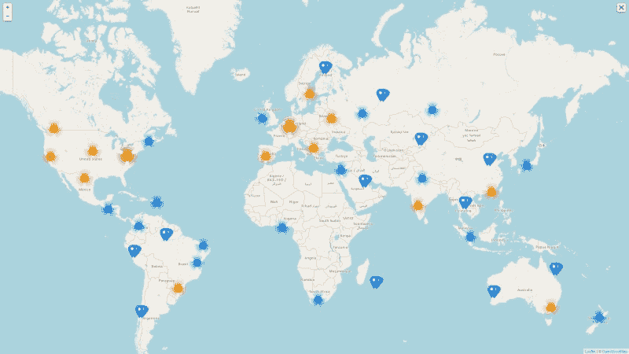
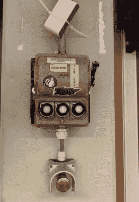

# 你是太空 API？

> 原文：<https://hackaday.com/2021/06/18/do-you-spaceapi/>

在 Hackaday，我们很荣幸成为全球黑客、制造商、技术爱好者和创意人员社区的一员，他们的集体工作使我们的每日新闻订阅如此引人入胜。我们在整个社区的许多活动中，或者在我们旅行中访问的各种黑客空间中，直接在物理世界而不是虚拟世界中遇到你们。但是，当有这么多黑客空间的时候，我们如何跟踪他们的世界呢？也许 [SpaceAPI](https://spaceapi.io/) 可能会有答案。

许多 Hackaday 的员工都与 hackerspaces 有着密切的联系，无论是作为成员、董事，甚至是创始人。这是我已经说过无数次的事情，因为我已经向牛津 Hackspace 或 MK Makerspace 的潜在成员展示过，世界上规模相当大的城镇和城市都有黑客空间，所以在合理的范围内，你可能走出机场的任何地方都会有我们一群人在一个充满工具和零件的房间里。

## 外面有一个完整的世界，只要你能找到它

The hackerspaces.org map of the world. Map data © OpenStreetMap contributors

世界上有如此多的黑客空间，很难跟上他们的步伐。对于黑客空间目录的维护者来说，这肯定是一件令人头疼的事情，新的到来以及空间可悲地关闭意味着一个目录只能是最新的。对于我们这些专业关注黑客空间世界的人来说，要保持领先是一件很困难的事情，我们知道总会有一些惊人的项目发布在黑客空间的网站上，而我们会与之擦肩而过。

发现活跃空间的一个简单方法是查看其网站或社交媒体订阅源。这是一个相当不错的打赌，因为[我在 Milton Keynes 的空间](https://mkmakerspace.co.uk/)最近有一个博客帖子，它是一个活跃的空间，并且(疫情规则允许)你将能够在开放的夜晚出现并看到这个地方(如果你正在访问 MK，请一定要做，并且在你在这里的时候参观一下[国家计算博物馆](https://hackaday.com/2016/09/13/review-the-national-museum-of-computing/)！).但是，如果一个空间的最后一次活动是在一年或 18 个月前呢？他们关闭了吗，或者他们只是更关心空间的运营而不是更新他们的网站？

## SpaceAPI 如何帮助您，以及为什么您的空间需要它

The RevSpace space state switch. Holly Hudson ([CC BY 2.0](https://www.flickr.com/photos/69505536@N03/45910657234)).

这就是 SpaceAPI 可以提供帮助的地方:为空间属性提供标准的 JSON 接口。这不仅包含所有的静态细节，比如位置和联系方式，还包含空间项目存储库的地址，最有趣的是，还包含空间是否开放的指示。JSON 可以是一个静态文件，但是在许多空间中，它是由空间本身生成的，这取决于空间中是否有人。

第一个拥有 SpaceAPI 端点的黑客空间是位于荷兰海牙的 RevSpace，如果你访问他们的网站，你会在他们的徽标上看到一个横幅。这和在[他们的 SpaceAPI 端点](https://revspace.nl/status/status.php)中报告的状态是由空间中的一个按钮产生的，该按钮操作他们的自动化系统并打开一切，其想法是打开和关闭空间是一个简单的按钮按压。我站在 RevSpace 看着这一切发生，这是那些活在未来的时刻之一，我很遗憾地承认这让我们在 MK 中落后了一点。经常阅读 Hackaday 的人可能记得我们对[的报道，他们创建了这个徽章来纪念他们的第十个生日](https://hackaday.com/2020/02/06/dutch-hackerspaces-at-ten-years-old-celebrating-a-community-with-a-special-map/)，它使用 SpaceAPI 数据在荷兰的空间中绘制成一个 led 阵列，效果很好。

SpaceAPI 维护者还发布了一个目录，各种可视化和其他项目从这个目录中提取数据。在写这篇文章的时候，名单上有 179 个黑客空间，大部分来自欧洲，也有一些来自更远的地方。如果您的空间还不在列表中，我想请您考虑创建一个 SpaceAPI 端点，并将其提交到目录中。你为什么要这么做？可发现性是黑客空间成功的关键，这意味着更多的潜在成员可以找到你，那些对黑客空间感兴趣的人，如 Hackaday scribes，也可以找到你。找到一个存在的空间，并且它是活跃的，使我们的一天，我们认为它也可以是你的一天。

标题图像:RevSpace 的 Decennium 徽章，它使用 SpaceAPI 数据进行可视化。