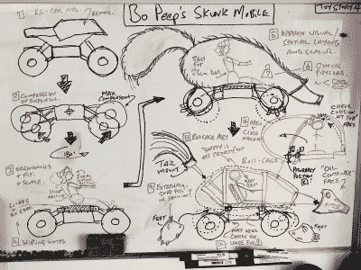

# 文档很难，让 SkunkWorks 项目向您展示如何做好它

> 原文：<https://hackaday.com/2021/09/12/documentation-is-hard-let-the-skunkworks-project-show-you-how-to-do-it-well/>

文档可能是一个有点讨厌的词，但它肯定是我们自己设计过程中的一个方面，我们都希望我们可以改进。作为一名获奖的设计师，与周围一些最好的玩具公司合作，[裘德]对展示你的作品略知一二。在他的 [SkunkWorks 项目](https://www.instructables.com/Bo-Peeps-Skunk-Mobile-Remote-Control-Plushy/)中，他用一种制造商的方法来制作 Bo Peep 的 Skunkmobile，并在这个过程中给我们上了一堂工程设计的大师课。

和任何好的项目简报一样，[Jude]首先列出他工作的动机。他非常惊讶皮克斯没有将 Bo Peep 的臭鼬手机商业化，并希望他的 DIY 努力可以从《玩具总动员》系列中激发更多包容性的玩具选择。他承认臭鼬手机比你的标准塑料玩具人偶提出了更独特的设计挑战。结合纺织品元素来创造皮毛的[幻觉](https://hackaday.com/2016/01/29/open-furby-opens-the-furby/)和 [RC 组件来赋予玩具机动性](https://hackaday.com/2019/07/30/driving-a-big-rc-car-on-the-ceiling/)需要深思熟虑。你肯定不希望在你绕着后院转的时候，轮子扯破布料，或者让毛皮钩住你在房子里经过的每个物体。

鉴于从头开始制造臭鼬车的设计挑战，[裘德]决定最好的方法是将定制设计的臭鼬形状的车身改装到标准的钢筋混凝土汽车底盘上。这里的困难在于找到一个可以支撑改装车身重量的底盘，以及一个足以在驾驶室内容纳 9 英寸 Bo Peep 娃娃的底盘。在花费数不清的时间 3D 打印(和重新打印)他的设计之前，[裘德]首先用卡片(用硬纸板)制作了臭鼬手机，这是我们在之前见过的[做法，并且](https://hackaday.com/2020/08/25/prop-driven-cardboard-rc-car-doesnt-skimp-on-performance/)[总是喜欢上](https://hackaday.com/2012/05/16/cardboard-kinetic-creatures/)。他不断强调他的设备的形式可能比它的功能更重要，因为捕捉 Skunkmobile 的本质以及“外观和感觉”是关键的设计标准。你甚至可以在他所有的演示视频中看到臭鼬摇尾巴。card 中的原型让 Jude 对他的 Skunkmobile 有了很好的感觉，设计也很好地转化为 3D 打印版本。

[Jude 的]项目真正给我们留下深刻印象的是他为整个设计过程提供的令人难以置信的细节，从背景故事，到最初的原型，到用户测试，最后，到最终产品的实现。记住，[“我们需要血淋淋的细节！”](https://hackaday.com/2021/04/27/how-best-to-get-your-project-on-hackaday/)

 [https://www.youtube.com/embed/riVxYJfVuAQ?version=3&rel=1&showsearch=0&showinfo=1&iv_load_policy=1&fs=1&hl=en-US&autohide=2&wmode=transparent](https://www.youtube.com/embed/riVxYJfVuAQ?version=3&rel=1&showsearch=0&showinfo=1&iv_load_policy=1&fs=1&hl=en-US&autohide=2&wmode=transparent)

