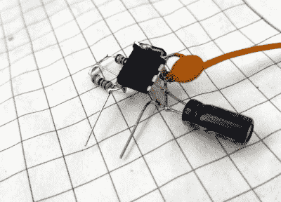

# 狗利用对讲机的力量

> 原文：<https://hackaday.com/2020/03/04/dog-harnessing-the-power-of-walkie-talkies/>

[javier.borquez]喜欢在黄昏时带着他的狗去遛狗公园。但是一旦太阳落山，[鲁西奥]挣脱了皮带，和其他狗一起疯跑，几乎不可能跟踪他。

当然，可能有夜光或发光的项圈，但如果你去商业，很有可能别人的狗会穿同样的东西。此外，买自己能做得更好的东西有什么乐趣呢？有了这个[狗距离指示器线束](https://www.instructables.com/id/LED-Distance-Indicator-Dog-Harness/)，你甚至不用编程。取而代之的是，当狗在范围内时，它使用一对廉价的改良对讲机来显示挽具上的绿色 led，当狗不在范围内时，则显示红色。

 虽然[哈维尔]的木偶师是最好的木偶师是的，他是，但不能指望[鲁西奥]按住按钮，吠叫他的位置。他的对讲机使用一个基于 555 的频率发生器和一个胶合按钮，以 1 kHz 的频率说话。

在[哈维尔]的对讲机中，有一个电阻器代替了扬声器，以保持对讲机部件的工作。还有一个半波桥式整流器，当[Rusio]在范围内时为电容器充电，当他在 6-8 米范围外时，电阻器消耗电容器。整流器的输出进入第二个 555，设置为施密特触发器，告诉晶体管打开红色发光二极管。

如果你想听你的狗远距离跟你说话，这里有一个蓝牙巴别鱼项圈。