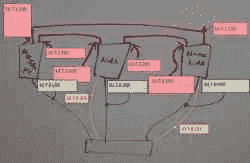

# 在家里做 10gb 网络，便宜的方式

> 原文：<https://hackaday.com/2019/07/24/doing-10-gigabit-networking-at-home-the-cheap-way/>

对于我们大多数人来说，千兆以太网对于日常任务来说绰绰有余。偶尔的大型网络文件传输可能会有点慢，但当您连接到 Cat 6 时，很少会出现带宽不足的情况。[Brian]渴望网络链路饱和，但是[决定只有 10 千兆以太网能满足](https://blog.briancmoses.com/2016/06/building-a-cost-conscious-faster-than-gigabit-network.html)。

已经是家中千兆以太网网络的所有者，[Brian]发现他现在经常能够用他现有的硬件饱和链接。他希望在现有的 NAS 上运行密集型虚拟机，同时又不造成带宽问题，现在是升级的时候了。不幸的是，将现有的家庭网络重新连接到 Cat 6，以及采购可以在铜双绞线上运行 10 千兆以太网的硬件的成本非常昂贵。

It’s a little ungainly, but it does the job.

相反，[Brian]决定将范围缩小到只连接 3 台机器。交换机非常昂贵，所以每台计算机都配备了双万兆接口，这样它就可以与另外两台计算机进行通信。选择的接口不依赖双绞线，而是使用 SFP+标准，其中网络电缆接受来自接口的电信号，并包含光纤收发器。

[Brian]只花了 120 美元就能让 3 台计算机联网，部件来自易贝。这是一种扩展性不好的方法；如果使用交换机和不那么古怪的网络拓扑，大型设置会更好。但对[Brian]来说，它工作得很好，并允许他的 NAS 在读取速率方面胜过 15，000 RPM 的服务器硬盘。

如果你对提高自己的网络性能感到好奇，先看看你的电缆可能会有好处——[事情并不总是像它们看起来的那样。](https://hackaday.com/2016/01/30/is-your-cat-6-ethernet-cable-cat-6-probably-not/)