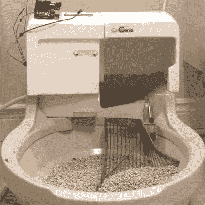

# 进行逻辑分析以绕过 CatGenie 的 DRM

> 原文：<https://hackaday.com/2018/09/04/doing-logic-analysis-to-get-around-the-catgenies-drm/>

CatGenie 是一个令人惊叹的设备，基本上是一个自动清洁的猫砂盒，甚至不需要更换猫砂。与维护堆肥厕所相比，这相当于室内抽水马桶对人类的意义。但是，有一个问题。它使用昂贵的肥皂盒，必须更换，因为 RFID 阅读器和使用计数器阻止你自己简单地重新填充它们。

CatGenie and Arduino

[David Hamp-Gonsalves] [对电子设备](http://www.davidhampgonsalves.com/reverse-engineering-cat-genie-120-drm/)进行逆向工程，这样他就不用再为墨盒付钱了。以前有人做过，其中一个人创造了[一个叫做 CartridgeGenius](https://hackaday.com/2015/01/19/cracking-litter-box-drm/) 的产品，但是它是作为一个兼职项目生产和销售的，并且没有库存。墨盒有一个 RFID 标签和[另一个解决方案是用 Arduino 替换 RFID 阅读器板，我们在](https://hackaday.com/2008/11/07/catgenie-hacking/)之前已经介绍过了。这就是[大卫]采用的解决方案。如果这不是什么新鲜事，为什么要写这篇文章呢？

RFID 阅读器板使用 I2C 与猫精灵的其余部分通信，他需要知道正在传输什么。为了做到这一点，他学会了如何使用廉价的逻辑分析仪来读取 I2C 电线上的信号，这使得这成为一个有趣的故事。您可以在他的博客和 GitHub 库上看到 logic analyser 的输出，以及他遇到的一个计时问题。从他所学到的，他写了 Arduino 代码，发送相同的信号。他和他的猫现在过着舒适的生活。

他没有做的是制作一个视频。但是当猫精灵经历了相当复杂的 30-35 分钟的过程时，看它的动作真的很棒，所以我们找到了它做事情的视频，以 3.5 倍的速度显示，并包括在下面。如果你喜欢那种东西。

 [https://www.youtube.com/embed/UeJ7hU5zcuQ?version=3&rel=1&showsearch=0&showinfo=1&iv_load_policy=1&fs=1&hl=en-US&autohide=2&wmode=transparent](https://www.youtube.com/embed/UeJ7hU5zcuQ?version=3&rel=1&showsearch=0&showinfo=1&iv_load_policy=1&fs=1&hl=en-US&autohide=2&wmode=transparent)

[via Adafruit]