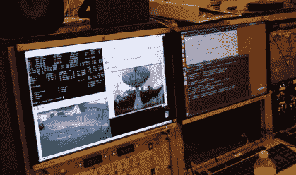
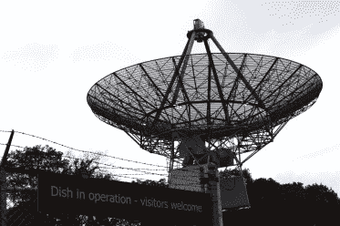

# 不要错过这个周末的 VCF 室内交换会

> 原文：<https://hackaday.com/2022/02/24/dont-miss-the-vcf-indoor-swap-meet-this-weekend/>

我们不需要告诉你，过去几年对于面对面的活动来说是一个真正的拖累。但是，经过去年夏天的一个小小的错误开始之后，我们终于可以抬起头来，重新做我们喜欢的事情了。那么，为什么不参加极客们最神圣的娱乐活动来庆祝呢:在满是灰尘的旧设备箱中搜寻一些电子宝藏呢？

 周六[老式计算机联合会(VCF)将在新泽西的信息时代科学和历史博物馆举办一场室内交换会](https://vcfed.org/wp/vcf-swap-meet/)，所有人都被邀请了。老式电脑自然会是主要的吸引力，但如果他们以前的活动有任何迹象，你应该期待桌子上摆满了通用电子产品、经典游戏和业余无线电设备的健康组合。门在早上 8 点准时打开，可以免费进入，所以我们建议早点出现，以便得到最好的选择。

不到一年前[我们参观了之前的 VCF 旧货交易会](https://hackaday.com/2021/04/28/vcf-swap-meet-takes-step-back-to-move-forward/)，当时由于新冠肺炎的担忧，该交易会不得不在户外举行，并被可供拍卖的怪异和精彩的硬件所震惊。从拱廊橱柜到便携式个人电脑和 3D 打印机，每个人都有一件小东西，而且价格都是最低的。我们唯一真正的抱怨是缺乏现场食品和饮料，根据 VCF 网站，这一点已经得到了解决。不过，没有消息说附近是否有自动取款机，所以你可能想在前往相对偏远的 Camp Evans 站点之前停下来取些现金。

下午 2 点交易会结束后，一定要去 InfoAge 看看复古电脑联盟的永久收藏，以及该网站提供的所有令人难以置信的展品和迷你博物馆。如果没有别的事，我们强烈建议您沿着这条路走到 TLM-18 太空遥测天线，普林斯顿大学目前将其作为 Linux 驱动的软件定义射电望远镜。

    

VCF 的精英们也在努力组织他们一年一度的东海岸老式电脑节，该节日将于 4 月 22 日至 24 日在 InfoAge 举行，所以请在你们的日历上做好标记。