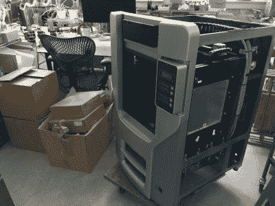
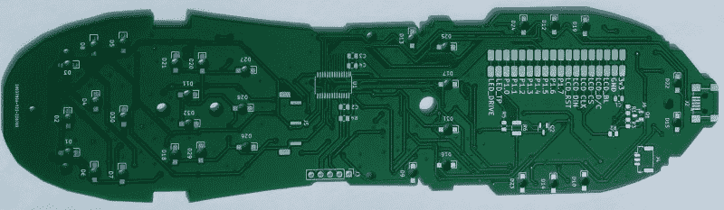

# 不要错过参加 Hack It Back 挑战赛的最后机会

> 原文：<https://hackaday.com/2022/07/21/dont-miss-your-last-chance-to-enter-the-hack-it-back-challenge/>

虽然 [2022 年黑客日奖](https://prize.supplyframe.com/)作为一个整体在一年中的大部分时间里蜿蜒前行，但构成比赛的每个单独的挑战只会在有限的时间内逗留。尽管很难相信，我们与 *Hack it Back* 挑战赛的时间即将结束，距离 7 月 24 日的截止日期只有几天了。

今年 Hackaday 奖的每个挑战都是围绕可持续性、弹性和循环性的核心主题设计的——对于竞赛的 *Hack it Back* 阶段，我们要求黑客们基本上尽可能地避免硬件被填埋。这可能意味着做一个简单的修复，让一个设备重新投入使用，或者可能是对一个旧设备进行彻底的重建，使其达到现代标准。Hackaday 就是建立在这些项目上的，所以今年把它变成一个正式的挑战是完全有意义的。

A single failed LED brought down this mighty beast.

在某种程度上，[浏览 *Hack it Back* 条目](https://hackaday.io/submissions/prize2022_hack/list)就像是在看一个精选的 Hackaday 集合。以[Gregor]完成的惊人修复为例。[他拿到了一台出现故障的 Stratasys Dimension SST](https://hackaday.io/project/186166-stratasys-dimension-sst-extruder-sensor-repair) ，并很快指出，照亮工业 3D 打印机腔室的发光二极管由于长时间暴露在高温下而出现故障。使用一些霍尔姆斯逻辑，他推断负责打印机的工具更换系统的红外发光二极管可能遭受了类似的命运。在更换了价值不到 1 美元的表面贴装 LED 后，这台价值 4 万美元的机器准备好了再次打印。

光谱的另一端是 [Notkia 项目](https://hackaday.io/project/185645-notkia-name-change-planned)，或者至少是以前被称为 Notkia 的项目。事实证明，诺基亚的律师并不热衷于文字游戏。无论这个项目最终被称为什么，这都是我们在相当长的一段时间里看到的最令人印象深刻的改造工作之一。这项合作旨在开发诺基亚 1680 的替代 PCB，将曾经简单的“哑手机”变成成熟的 Linux 手持设备。注意，我们没有说 Linux *手机*，因为至少现在，没有实际的蜂窝硬件包括在内。但它拥有你可能想要的任何东西，都装在一个非常便携和坚固的外壳中。

说到替换 PCB，来自[mulcmu]的这个项目希望升级 2000 年代早期的罗技 Harmony 880 通用遥控器，以更好地与今天的设备接口，这些设备越来越多地使用 WiFi 进行连接。最终的硬件将使用 ESP32 和开源固件来连接各种各样的消费电子产品，但在这个早期阶段的当务之急是设计电路板。我们不禁钦佩第一块 alpha 电路板对细节的关注，这也提醒我们这些低成本 PCB 晶圆厂有多好:他只支付了每块电路板 1.60 美元，四天后它们就出现在了他的门口。不真实。

我们承认这一轮有一些非常激烈的竞争，但这什么时候阻止过这个社区迎接挑战呢？如果你有一个令你特别自豪的修理、升级或完全重建，不要再等着炫耀了。

你所要做的就是[在 Hackaday.io](https://hackaday.io/project/add) 上做一个新项目，然后[提交给挑战](https://hackaday.io/contest/184555-supplyframe-designlab-2022-hackaday-prize)。如果你在等待最后一分钟来戏剧性的出场，这就是了。

The [HackadayPrize2022](https://prize.supplyframe.com) is Sponsored by: