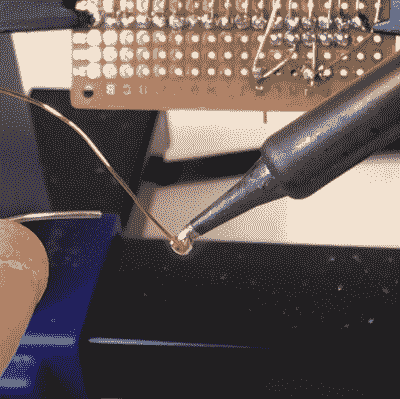

# 不要刮电磁线，改做这个

> 原文：<https://hackaday.com/2020/03/09/dont-scrape-magnet-wire-do-this-instead/>

[汤姆]不太喜欢面包板。他更喜欢用穿孔板连接原型，用漆包线点对点焊接。这对你们中的一些人来说可能听起来很麻烦，但[Tom]已经提出了一些技巧来使用穿孔板和磁线制作原型更容易和更有效，最大的技巧是关于如何管理剥离所有磁线。

Push the tip of the magnet wire a small distance into the molten solder and hold it there for a few moments. The solder will bubble away the enamel and tin the copper underneath in the process.

电磁线是一种薄的实芯导体，具有透明的搪瓷涂层。这种珐琅起着电绝缘体的作用。剥去珐琅，露出下面闪亮的铜的通常方法是刮掉它，但当处理大量连接时，这将变得令人厌倦。[Tom]更喜欢用烙铁尖上的一滴熔化的焊料“把它煮掉”。

首先熔化烙铁上的少量焊料，然后将磁线的尖端推入熔化的焊料中一小段距离，并保持一会儿。在这个过程中，搪瓷会起泡，焊料会给下面的铜上锡。诀窍是使用新的焊料，并在应用之间清洁尖端。你可以在下面的视频中看到他在 1:00 左右演示了这一点。

一旦电磁线的尖端镀锡，就可以根据需要进行焊接。电磁线弯曲得很好，并能很好地保持其形状，因此布线和切割并不太困难。[Tom]还推荐了一个很好的免提 PCB 支架，并指出 0603 尺寸的 SMT 电阻非常适合安装在 perfboard 的 0.1”焊盘之间。

Perfboard(和 veroboard)长期以来一直是原型制作的备用产品，但仍有人试图对其进行改进，通常是通过[允许在同一电路板上结合通孔和表面贴装器件](https://hackaday.com/2018/01/09/improved-perfboard-for-surface-mount-parts/)，但您可以在下面的视频中看到[Tom]在普通的老式 perfboard 上使用磁线进行演示。

[https://player.vimeo.com/video/393224803](https://player.vimeo.com/video/393224803)