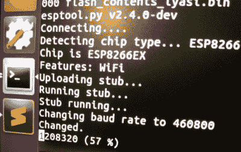

# 不要扔那个灯泡，它知道你的密码

> 原文：<https://hackaday.com/2019/01/29/dont-toss-that-bulb-it-knows-your-password/>

无论是在 Hackaday 还是在互联网上的其他地方，你现在肯定已经听过不少关于“物联网”的警示故事了。事实证明，让你拥有的每一个小工具都可以访问你的个人信息和互联网连接可能会导致意想不到的后果。谁知道呢，对吧？但如果你需要另一个例子来说明为什么把秘密托付给你的家用电器是一个潜在的坏主意，那么【有限结果】可以确保你在接下来的几个小时里怀疑你最近购买的科技产品。

[在【有限结果】博客](https://limitedresults.com/2019/01/pwn-the-lifx-mini-white/)上的一系列帖子中，低成本的“智能”灯泡被砸开并被调查，以了解它们设法收集了关于它们主人的什么样的知识。不仅发现小米、LIFX 和图雅生产的灯泡以明文形式存储 WiFi SSID 和加密密钥，而且从灯泡中恢复所述信息实际上非常简单。所以下次那些廉价的智能灯泡开始闪烁的时候，你可能想在把它扔进垃圾桶之前用锤子敲它一下；你永远不知道它，以及它对你的网络的了解，可能会在哪里结束。

 不管灯泡的制造商是谁，在你的网络上获得这些设备的过程或多或少都是一样的。智能手机上的应用程序连接到灯泡，并为其提供网络 SSID 和加密密钥。灯泡然后断开与手机的连接，并使用新信息重新连接到您的家庭网络。这是一个过程，在这一点上，我们可能都很熟悉，它本身没有任何问题。

当灯泡需要存储提供给它的连接信息时，麻烦就来了。SSID 和加密密钥以明文形式存储在灯泡的 WiFi 模块上，而不是以某种方式混淆它。恢复这些信息只是一个在灯泡的 PCB 上找到正确轨迹的过程(通常有测试点使这变得非常容易)，然后将芯片的内容转储到计算机进行分析。

像这样的智能灯泡使用 ESP8266 或 ESP32 并不罕见，[有限的结果]发现这里就是这种情况。有了这些非常流行的 WiFi 模块可用的大量信息和软件，转储固件二进制文件就不成问题了。一旦有了二进制文件，用十六进制编辑器稍微窥探一下就可以识别网络登录信息了。固件转储还包含灯泡连接的“云”平台使用的唯一硬件 id 等信息，至少在一个案例中，找到了根证书和 RSA 私钥。

从积极的一面来看，能够购买运行 ESP [等容易破解的模块的廉价智能设备，使我们更容易为它们创建定制固件](https://hackaday.com/2017/10/01/custom-lightbulb-firmware/)。希望社区能拿出稍微不那么可疑的软件，但真的只是[阻止这些东西连接到本地网络之外的任何东西](https://hackaday.com/2018/04/16/reprogramming-cheap-wifi-outlets/)将是朝着正确方向迈出的一步。

(几天后……)

[有限的结果]向我们暗示，他之前向灯泡制造商披露了一些漏洞，但在他们修复这些漏洞之前，他不想公开这些漏洞。它们现在已经修好了，看起来灯泡通过网络发送的所有东西都没有加密——你的数据，OTA 固件升级，所有的东西。他们现在正在使用 TLS，所以干得好[有限的结果]！如果你用的是旧版本的灯泡，你可以看看。

在 WiFi 凭证上，我们被告知:“在闪存中的敏感信息没有加密的情况下，新版本将包括加密存储处理，客户将能够选择这一版本的安全芯片，这可以有效避免未来的安全问题。”在评论中争论这到底意味着什么。