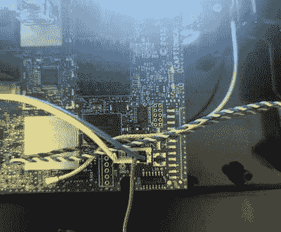

# 桌上电话的厄运只是冰山一角

> 原文：<https://hackaday.com/2021/08/13/doom-on-a-desk-phone-is-just-the-tip-of-the-iceburg/>

如今，我们预计即使是最便宜的一次性智能手机也会配备多核处理器、至少 1gb 的内存和基于 Linux 的操作系统。但是很明显，对于一部老式的 POTS 台式手机来说，这些规格是不必要的。我们也是这么想的。[然后[Josh Max]写信告诉我们他入侵标题电话](https://joshumax.github.io/general/2021/08/11/running-doom-on-captioncall.html)的冒险经历，现在我们急切地想看看这个社区能在一部功能惊人的 Linux 手机上用 root access 做些什么。

顾名思义，CaptionCall 是一款台式电话，键盘上方有一个 LCD，可以显示实时字幕。在美国，任何有听力损失的人都可以从政府那里免费得到一部这样的手机，所以它们在二手市场上自然卖得很便宜。至少他们做到了。然后[Josh]不得不继续破解 ARMv7 i.MX6 驱动的手机的 root 密码，开始在它的 4 GB 板载 NAND 中摸索，并让它运行 DOOM。

Tapping into the serial port.

如果你对技术细节感兴趣，[Josh]已经做了很好的工作，带我们一步一步地完成了他的过程。这个故事对于玩过嵌入式 Linux 设备的人来说至少有些熟悉，不出所料，它是从在 PCB 上找到一个串口头开始的。

发现环境变量被牢牢锁定，他采取了缓慢的路线，用 U-Boot 的“内存显示”命令一次转储 80 个字符的手机固件。将恢复的固件映像通过`binwalk`和密码破解程序，他很快就获得了根证书，从那里，串行端口变得更加有用。

[Josh]抛弃了手机原有的用户界面，建立了 ARM Debian Jessie chroot，并开始朝着全功能的 Linux 环境努力。有了音频，视频，甚至键盘的支持，他准备启动每个人都喜欢的 1993 年射手。[他非常友好地在 GitHub 资源库](https://github.com/joshumax/dumping-ground/tree/master/bonanza_hacks)中分享了他的工作，虽然这可能不是交钥匙的体验，但所有的部分都在这里，完全按照你的意愿弯曲硬件。

从历史上看，[在一个新的硬件上运行 DOOM](https://hackaday.com/2020/11/22/doom-running-on-the-nintendo-game-watch/)一直是更大更好的东西到来的先兆。随着对其 Linux 操作系统的自由访问的开放，我们预测 CaptionCall 将成为一个流行的黑客目标，我们迫不及待地想看到它。