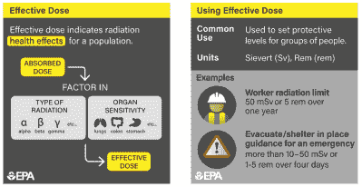
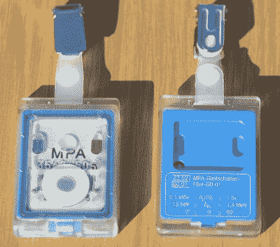
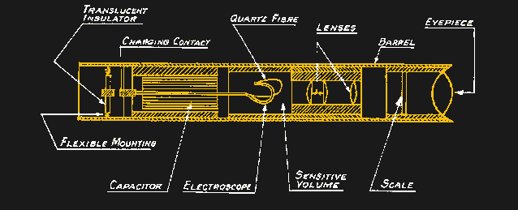
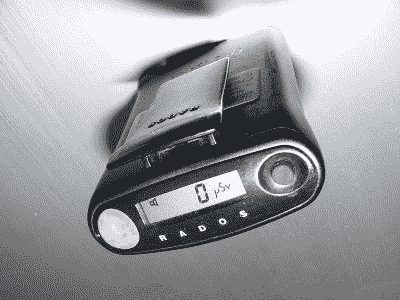

# 剂量测定:测量辐射

> 原文：<https://hackaday.com/2022/11/07/dosimetry-measuring-radiation/>

由于在我 20 岁出头时做过 x 光技术员，然后在各种生物实验室工作到我 40 岁出头，我一生中的大部分时间都被归类为电离辐射方面的“职业暴露工人”。虽然我在那把伞下做的工作千差万别，但它们都有一些共同点。一个是规定的年度辐射安全培训课程。由于物理学从未改变，规则也很少改变，这些会议不可避免地让每个人都感到厌烦，这是一个遗憾，因为我总觉得这是我应该密切关注的事情，就像空乘人员提供的安全简报，但每个人都忽略了。

另一个共同点是需要记录我和我的同事受到了多少辐射。除了对我们个人明显的健康和安全影响之外，还有对各种相关机构的法律和监管考虑，这解释了在打印输出上找到你的名字并在你的剂量计测得的当月剂量上签字的仪式。

自从我被积极地认为是职业暴露以来，剂量学已经有了很大的发展，甚至比人们对辐射对活组织的影响知之甚少的时代还要久远。放射化学的早期先驱们对暴露危险的了解确实来之不易，但给了我们发展放射剂量测定方法和工具所需的洞察力，使辐射工作比以往任何时候都更加安全。

## 拉德和雷姆，西弗茨和灰色

虽然有很多工具可以测量一个人接受的辐射剂量，但需要有一些方法将这些数据放入有意义的生物学背景中。为此，存在一个完整的测量系统生态系统，所有这些都可以归结为一些基本的物理学和生物学原理。

第一个原理是辐射源都能够将动能以电离粒子(α和β辐射)或电磁波(γ辐射和 X 射线)的形式传递到组织中。不同类型的辐射对组织有不同的影响，在计算剂量时，需要通过反映辐射相对生物有效性(RBE)的加权因子，将这些差异考虑在内。这基本上是衡量辐射包的强度。例如，阿尔法粒子是相对较重的氦核，其重量是贝塔、伽马或 X 射线的 20 倍。

剂量测定法背后的第二个原则是生物学性质的，它反映了这样一个事实，即在几乎所有情况下，生物体所经历的辐射的任何有害影响都是由与其 DNA 的相互作用引起的。当然还有其他影响，如细胞细胞质中的电离和自由基的产生，但总的来说，辐射的大问题是因为它撞上了 DNA，特别是在它进行自我复制的过程中。这就是为什么造血器官(主要是骨髓)、消化系统内层和性腺中快速分裂的细胞对辐射特别敏感。

Effective dose takes the type of radiation and the biological sensitivity of various organs into account. Source: [EPA](https://www.epa.gov/radiation/radiation-terms-and-units)

考虑所有这些因素和更多因素的需要导致了大量的剂量测量系统，其单元针对不同的应用而设计。在国际单位制中，*吸收剂量*的基本单位是戈瑞(Gy)，即每千克物质一焦耳。考虑到辐射的 RBE，*当量剂量*是以西韦特(Sv)为单位测量的，西韦特是以焦耳/千克为单位的吸收剂量乘以无量纲权重因子。类似地，*有效剂量*也用西弗表示，是有效剂量乘以另一个基于目标组织对辐射的敏感度的无量纲因子。更复杂的是，非 SI 单位(吸收剂量的 rad，等效和有效剂量的 rems)仍在广泛使用，许多剂量计仍以这些单位校准。

## 模糊的电影

虽然记录职业暴露的辐射工作人员所受剂量的特别方法可以追溯到放射化学的早期，但创造一种监测辐射工作人员的系统方法的第一次尝试应归功于在芝加哥冶金实验室工作的物理学家 E.O. Wollan。作为曼哈顿计划中研究钚的放射化学的一部分，Wollan 认识到精确监测暴露的必要性，并于 1942 年发明了第一个胶片徽章剂量计。他的装置很简单:一个不透光的信封，里面装着一条摄影胶片，放入一个铝制支架中。Wollan 还包括一个由镉制成的过滤器，以平衡电影对不同类型辐射的反应。冲洗胶片可以显示辐射使胶片变得模糊的程度，用光密度计很容易读出。

Film badge dosimeters. Source: [Henry Grabowy](https://commons.wikimedia.org/wiki/File:Filmdosimeter.jpg), Copyrighted free use.

由于易于使用、低成本、高灵敏度和紧凑的尺寸，胶片徽章剂量计直到最近才成为事实上的标准。现代版本更可能由塑料制成，而不是 Wollan 博士的铝，但它们仍然包含各种金属作为过滤器。开发电影徽章，甚至阅读它们最终成为自动化的过程，系统被开发出来，每个月可以处理数百万个徽章。

胶片徽章剂量计的一个缺点是，在佩戴一个月并显影之前，它们不会提供关于接收剂量的反馈。虽然这在大多数医疗和学术环境中可能是好的，在这些环境中辐射暴露预计通常较低，但一些剂量计的设计是为了在环境更活跃的情况下提供持续的读数。自指示袖珍剂量计的设计可以追溯到 1937 年。SIPD 通常是一支钢笔大小的管子，一端有一个密封的充气室。室内有一个验电器，由一根柔性石英纤维和一个固定电极组成，还有一个带有校准十字线的显微镜。当向电极施加高电压时，静电场使石英纤维向标线片上的零标记弯曲；当电离辐射穿过电离室时，电荷被慢慢地从电极上去除，使电极在刻线刻度上进一步弯曲。佩戴者可以在用电池供电的便携式充电器给容器充电之前，通过显微镜轻松跟踪剂量。

A quartz fiber dosimeter. It’s basically a small electroscope that gets charged by a portable HV supply; radiation passing through the chamber knocks out charge and deflects the fiber, which is read on a reticle through a small microscope.

带有熟悉的红色、白色和蓝色民防标志的亮黄色 SPIDs 在美国冷战期间变得非常流行。制造了数以百万计的设备，其中一些设备的刻度只能在灾难性的高辐射环境中使用。SPIDs 是非常坚固的设备，其中大多数在几十年后仍然可以工作，甚至充电器及其非常简单的电子设备仍然可以正常工作。

## 固态

胶片徽章和石英纤维 SPIDs 很方便，但技术在进步，更便宜、更好的剂量测定方法在很大程度上取代了它们。热释光剂量测定法(TLD)已经成为一种非常流行的跟踪照射的方法。它依赖于某些材料“捕获”由穿过它们的高能光子激发的电子的趋势。这些被捕获的电子在晶体基质中的积累与通过它的辐射量成正比，只需加热就可以释放到它们的基态。释放的光被光电探测器拾取，并用于计算接收的剂量。

 [https://www.youtube.com/embed/MEPnbLE8F1A?version=3&rel=1&showsearch=0&showinfo=1&iv_load_policy=1&fs=1&hl=en-US&autohide=2&wmode=transparent](https://www.youtube.com/embed/MEPnbLE8F1A?version=3&rel=1&showsearch=0&showinfo=1&iv_load_policy=1&fs=1&hl=en-US&autohide=2&wmode=transparent)

大多数商业剂量学应用的 TLD 是基于掺杂少量锰或镁的氟化锂晶体，这产生了电子陷阱。例如，TLD 晶体可以小到可以嵌入一个塑料环中，用来监测四肢在处理放射性同位素时所受到的剂量。一种相关的方法，称为光激发光(OLS)，使用氧化铍陶瓷作为捕获材料；使用调谐到特定频率的激光从阱中释放电子，光电探测器读取发射的光。

An electronic personal dosimeter (EPD) using a PIN diode sensor. Source: by [Rama](https://commons.wikimedia.org/wiki/File:Crocus-p1020509.jpg), CC BY-SA 2.0 FR.

像电影徽章一样，TLD 和 OSL 不能向佩戴者提供剂量的实时反馈。幸运的是，紧凑型电子个人剂量计现在正被广泛使用。大多数 epd 使用不起眼的 PIN 二极管作为传感器。与 PIN 二极管在反向偏置时对光敏感的方式非常相似，这是因为它们具有较大的未掺杂本征区(PIN 中的“I ”), epd 使用反向偏置的 PIN 二极管来计数穿过它们的电离辐射光子。当光子撞击本征层时会产生电荷载流子，从而产生可以放大的小电流。微控制器累计计数并显示计算的当量剂量；大多数 epd 也可以选择在达到设定值时发出警报。

另一个令人感兴趣的辐射传感器是 MOSFET，虽然它在放射治疗中更多地用于体内剂量测定，而不是个人剂量测定，但它与 TLD 中使用的材料具有相似的特性。MOSFET 对电离辐射敏感的区域是隔离栅极、源极和漏极的二氧化硅层。当辐射穿过 MOSFET 时，在 SiO [2] 层中产生电子空穴对。空穴迅速迁移到二氧化硅 [2] 和 N 型硅之间的界面，逐渐增加晶体管的阈值电压。它接受的辐射越多，就越难打开 MOSFET 总剂量可以通过测量这种变化来计算。

MOSFET 剂量计的有趣之处在于，晶体管中累积的损伤充当了接收剂量的永久记录。缺点是对 MOSFET 的累积损伤最终使其不能用作传感器。实际极限是大约 100 戈瑞的吸收剂量，这是 48 小时内 100%致命的全身吸收剂量的三倍多。