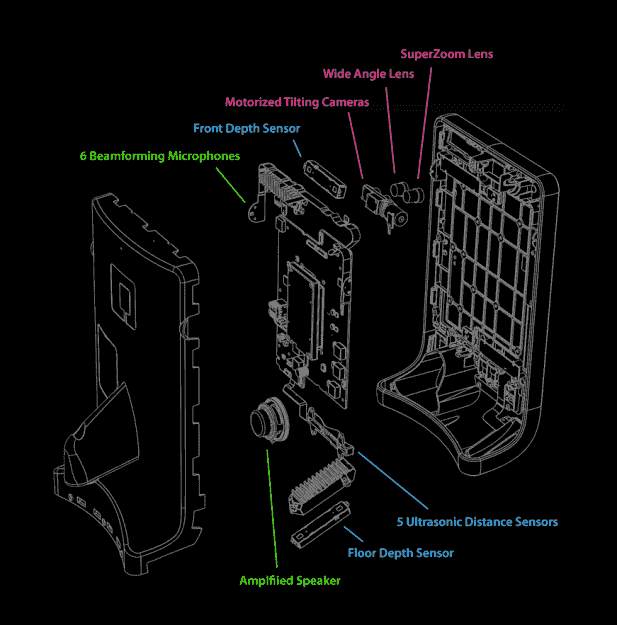

# 双重 3:无论您身在何处，您都可以即时出现在任何地方

> 原文：<https://hackaday.com/2019/08/31/double-3-your-instant-physical-presence-anywhere-no-matter-where-you-are/>

网真是几十年来出现过几次的未来流行语之一；承诺能够在纽约参加一个会议，一小时后在东京参加另一个会议，所有这些都不需要离开你舒适的家或办公室。这是 Double Robotics 的“双 3”的前提，这是它最近进入这一细分市场，作为与 T2 更多 DIY 产品 T3 的商业对比。

More than just a glorified tablet screen.

它看起来像一个放置在 Segway 顶部的平板电脑，内置的 1300 万像素双摄像头使控制器能够清楚地看到周围的环境，而 6 个波束形成麦克风理论上应该可以让一个人在会议或工作场所拾取任何对话。

续航时间限定为 4 小时，内置电池充电需要 2 小时。幸运的是，如果电池没电了，你可以跳到另一个新充电的 Double 3 上。假设 3999 美元的价格标签不会妨碍他们组建一支舰队。

该产品最有趣的方面可能是其自动驾驶功能，这导致安装了一系列传感器和摄像头(英特尔 RealSense D430 立体视觉深度传感器)。为了处理这些传感器数据，该系统配备了一个 NVidia Jetson TX2 ARM 板，运行 Ubuntu Linux，它还为用户呈现了混合现实 UI，其中包含路点和其他信息。

目前，Double Robotics [接受 Double 3 API 私人测试版](http://www.doublerobotics.com/developer.html)的注册，这将使开发者能够访问传感器数据和 [Double 3 硬件](http://www.doublerobotics.com/tech-specs.html)的各种自主功能。Double Robotics 的联合创始人[Marc DeVidts]向 Hackaday 表示，他很期待看到人们可以用它来建造什么。希望这一次人们不会简单地拿这个东西兜风，就像[与双 3 的前任](https://hackaday.com/2014/11/26/telepresence-robot-demo-unit-breaks-free-of-its-confinement/)发生的事情一样。