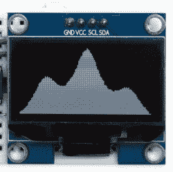

# 在 ATtiny85 的有机发光二极管上绘图，不允许 RAM 缓冲

> 原文：<https://hackaday.com/2018/11/01/drawing-on-an-oled-with-an-attiny85-no-ram-buffers-allowed/>

如今，小型 I2C 有机发光二极管显示器很常见，由于开发人员的努力，也有各种各样的图形库可以使用它们。它们中的大多数都是通过使用 RAM 缓冲区来工作的，这意味着任何想要绘制的东西都会被写入代表屏幕的缓冲区，并且每当显示器更新时，缓冲区的内容都会被复制到显示器上。缺点是对于一些微控制器来说，没有足够的 RAM 来支持这种方法。例如，128×64 单色有机发光二极管需要 1024 字节的缓冲区，但如果像 ATtiny85 这样的微控制器总共只有 512 字节的 RAM，这是个坏消息。[戴维·约翰逊-戴维斯]有两个解决方案:[一个不需要 RAM 缓冲区的微型图形库](http://www.technoblogy.com/show?23OS)和一个更纤薄的微型功能绘图仪，我们将按顺序讨论。

*Tiny Function Plotter* works on both SSD1306 and SH1106-based displays.

[David]的微型图形库利用了 SH1106 基于驱动程序的显示器的一个特性:在 I2C 上读取和写入显示器的能力。由于能够一次对一个部分执行读-修改-写操作，因此可以避免使用大型 RAM 缓冲区。唯一的问题是，该库只能与使用 SH1106 的 OLEDs 一起工作，但好消息是，这些在通常的中国经销商处非常常见。([David]注意到 SH1106 有时会被拼错为“SSH1106”，所以在搜索时要记住这一点。)

那么其他基于 SSD1306 的有机发光二极管显示器呢？他们运气不好吗？不完全是。[David]还有一个锦囊妙计:他的[微型功能绘图仪](http://www.technoblogy.com/show?2CFT)可以在 SSD1306 上工作，也不需要 RAM 缓冲。它不能写文本，但它可以很容易地处理绘图，绘制数值等随时间变化的东西，而只需要很少的开销。

我们看到的另一种使用由内存有限的微控制器驱动的 OLEDs 的方法是在[小侧面俄罗斯方块](https://hackaday.com/2018/05/20/tiny-sideways-tetris-on-a-business-card/)中使用的解决方案【Michael】，这部分是通过实现他需要的最小屏幕元素是 4×4 块，并使用该前提作为简单压缩方案的基础来完成的。