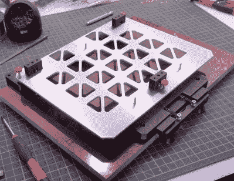

# Dremel 3D20 打印机得到现代检修

> 原文：<https://hackaday.com/2020/11/14/dremel-3d20-printer-gets-modern-overhaul/>

Dremel 在 2014 年试图打入 3D 打印机市场，这是值得尊敬的，如果不是特别令人兴奋的话。他们的 3d 20“Idea Builder”不是设计自己的打印机，而是一个轻度定制的 Flashforge Dreamer(本身是 Makerbot Replicator 的克隆版)，附加了新的保修和支持合同。它不一定是黑客和制造商群体的首选 3D 打印机，但对于想要交钥匙体验的人来说，它是一个相当可靠的选择。

[Chris Chimienti]说他的 3D20 打印了大约 1000 个小时才停止。鉴于机器的年龄及其固有的局限性，他决定使用 [Dremel 的尸体作为一台非常令人印象深刻的定制 3D 打印机](https://www.thingiverse.com/thing:4637810)的基础，配有所有现代的铃铛和哨子。他保留了外壳、杆、轴承和步进电机，但几乎所有其他东西都被扔掉了。一些替代品是现成的部件，但这种构建的定制设计元素真正有助于将其与众不同。

A print bed strong enough to park your car on.

在机器下面，[Chris]安装了一个新的电源和一个 Duet 2 WiFi 控制器，它本身连接到前面的新 LCD 控制面板。有一个外部风扇来保持电子设备的冷却，但除此之外，引擎盖下的东西看起来比原来整洁多了。

向上移动，他的[设计了一个华丽的可调印刷床](https://www.thingiverse.com/thing:4637799)和一个新的挤出机组件，巧妙地使用 RJ45 插孔和以太网电缆连接回控制板。总的来说，定制组件已经将这个曾经相对中档的 3D 打印机变成了[看起来不会与国际空间站格格不入的东西。](https://hackaday.com/2019/02/04/the-thrill-of-building-space-hardware-to-exceptionally-high-standards/)

虽然像这样的定制 3D 打印机仍然不时出现，但我们现在看到的比 3D20 这样的机器上市时要少得多。大多数人对商业入门级桌面打印机非常满意，并不想再找一个项目来修补。这没什么错，尽管如果[最近对更先进的高温灯丝的兴趣](https://hackaday.com/2020/10/28/bringing-high-temperature-3d-printing-to-the-masses/)引发了定制 3D 打印机的复兴，我们肯定不会抱怨。

 [https://www.youtube.com/embed/kwhxN6nFGR4?version=3&rel=1&showsearch=0&showinfo=1&iv_load_policy=1&fs=1&hl=en-US&autohide=2&wmode=transparent](https://www.youtube.com/embed/kwhxN6nFGR4?version=3&rel=1&showsearch=0&showinfo=1&iv_load_policy=1&fs=1&hl=en-US&autohide=2&wmode=transparent)

