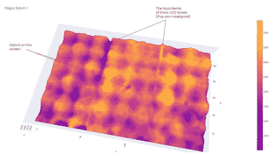

# DrLCD 是来检查你的 MSLA 打印机的

> 原文：<https://hackaday.com/2022/12/08/drlcd-is-here-to-give-your-msla-printer-a-checkup/>

在过去的几年里，我们已经看到了掩蔽立体平版印刷(MSLA) 3D 打印机的绝对爆炸，这些打印机使用 LCD 屏幕来选择性地阻挡来自强大的 LED 阵列的 UV 光。结合步进电机，逐渐将构建板从屏幕上抬起，这种安排可用于从光敏树脂中产生高分辨率的 3D 打印。这些机器很便宜，相对简单，最终结果可能是惊人的。

但是它们并不是万无一失的。正如[Jan Mrázek]解释的那样，[这些打印机的好坏取决于它们的光学设置](https://blog.honzamrazek.cz/2022/12/about-the-successful-quest-for-perfect-msla-printer-uv-backlight/) —如果它们没有一致的紫外光源，或者屏蔽 LCD 不能正常工作，最终打印的部分将会受到影响。为了更好地理解这些因素是如何影响打印质量的，他设计了 DrLCD:一个安装在机械臂上的 TSL2561 亮度传感器，带有相关的软件来绘制打印机的光源。

The individual LED assemblies are clearly visible.

对几种不同类型的打印机运行 DrLCD 的结果非常有趣。[Jan]能够清楚地辨认出所用镜头的类型，在一种情况下，甚至能够检测出扫描中的暗点是由于一点树脂泄漏到光源中并使光学元件变得模糊。

但是 DrLCD 能做的不仅仅是告诉你哪里有暗点。使用从扫描中收集的数据，可以创建一个“补偿图”，它可以与您希望打印的切片模型相结合。由于切片器假设了一个理想的光源，该贴图可以通过在检测到显示器亮点的地方添加额外的遮罩来提供帮助。

[Jan]接着比较了模型应用补偿图前后打印零件的尺寸精度，并发现了微小但明显的改进。不是每个人都会担心在没有背光补偿的情况下观察到的 157 米偏差，但我们肯定不会抱怨 3D 打印机在尺寸上变得更加精确。

几年前，我们报道过一个类似的技术，使用 DSLR 捕捉床的高分辨率图像。虽然可以说更容易实现，但我们不禁爱上了进入 DrLCD 系统的辉煌的过度工程，我们不能等到它开始出诊。