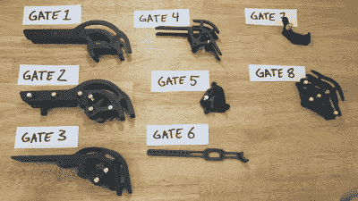

# 以毫秒级的精度投掷弹珠

> 原文：<https://hackaday.com/2022/10/31/dropping-marbles-with-millisecond-accuracy/>

The road to the perfect marble dropper

[Wintergatan]乐队的[Martin]正在第三次寻求建造终极音乐弹珠机，这意味着以最大的可靠性和精确的计时来投掷弹珠。经过几次迭代，回到基本原则，他设计了一个弹珠门，它能以 0 毫秒的时间标准偏差落下弹珠。

[Wintergatan]的前两台机器，[大理石机](https://hackaday.com/2016/03/03/incredible-marble-music-machine/)和[大理石机 X](https://hackaday.com/2020/05/16/all-about-that-bass-marble-machine-x-keeps-growing/) 获得了极大的关注，但它们的复杂性是它们失败的原因。事实证明，一台制作音乐的 Rube Goldberg 机器有很多潜在的故障点，两台机器都被证明对现场舞台来说太不稳定了。第三个版本，Marble Machine XT (T 代表“touring”)需要重新设计以实现简单性和可靠性，以便在道路上实用。

[Martin]将大理石机器的概念分解为关键部件，其中最明显的是大理石闸门。使用一对接触式麦克风来记录释放和撞击的时刻，他可以精确地测量时间。第一个设计的标准偏差为 3.91 毫秒，这远远不够我们用耳朵来检测，但也达不到[马丁]的“紧凑音乐”标准。它使用了一个时钟式[擒纵机构](https://hackaday.com/2018/06/21/clock-this-a-3d-printed-escapement-mechanism/)，其中轮子是释放门。在查看了他的测量软件并补偿了他的设置的软件组件之间的漂移后，测量的标准偏差减少了 1 毫秒。另一个突破是移除了闸门下方的任何引导表面，并让重力来完成所有工作。第八次迭代被证明是赢家，并使用擒纵臂作为下降门和轮子来阻止弹珠的队列。

来自艺术背景，[马丁]不得不艰难地学习许多工程课程。看着他的 YouTube 频道上的视频，似乎他正在用心学习这些课程，我们期待着看到大理石机器 XT 的诞生。

 [https://www.youtube.com/embed/lC_oLb1pfqU?version=3&rel=1&showsearch=0&showinfo=1&iv_load_policy=1&fs=1&hl=en-US&autohide=2&wmode=transparent](https://www.youtube.com/embed/lC_oLb1pfqU?version=3&rel=1&showsearch=0&showinfo=1&iv_load_policy=1&fs=1&hl=en-US&autohide=2&wmode=transparent)

 [https://www.youtube.com/embed/VyIk0IqC7SQ?version=3&rel=1&showsearch=0&showinfo=1&iv_load_policy=1&fs=1&hl=en-US&autohide=2&wmode=transparent](https://www.youtube.com/embed/VyIk0IqC7SQ?version=3&rel=1&showsearch=0&showinfo=1&iv_load_policy=1&fs=1&hl=en-US&autohide=2&wmode=transparent)

