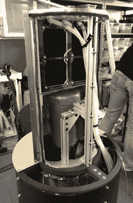

# 在一分钟或更短的时间内烘干你的衣服

> 原文：<https://hackaday.com/2019/10/07/dry-your-clothes-in-one-minute-or-less/>

如果你像大多数人一样，那么洗衣服对你来说可能是一种巨大的痛苦。计算出洗衣和烘干周期所需的奇数分钟数，拼命不要让衣服湿湿的，最糟糕的是不得不等待*所以*长时间等待你的衣服变干净可能是一件很麻烦的事情。

 一组发明家决定建造 [Eleven，一种能在一分钟或更短时间内烘干和消毒衣物的烘干机](https://hackaday.io/project/167269-secco-the-1-minute-clothing-dryer)。正如在他们的[演示视频](https://vimeo.com/211184582)中解释的那样，衣服被放置在中心管周围，并由 Eleven 启动的气流干燥。注入香料和臭氧是为了防止细菌产生难闻的气味。

该小组试验了超声波和微波真空系统，并最终决定使用一种控制织物内空气流动的方法。蒸汽发生器向衣物喷洒消毒剂，同时过滤器将化学品隔离到设备内的容器中。

他们还安装了传感器来远程监控机器的性能，允许用户跟踪他们的衣服和机器的健康状况，即使他们不在家。一些我们以前在 DIY 领域看到过的事情。

这可能不是我们承诺的未来无热干衣机，但 11 看起来肯定是朝着正确方向迈出的一步。

The [HackadayPrize2019](https://prize.supplyframe.com) is Sponsored by:     