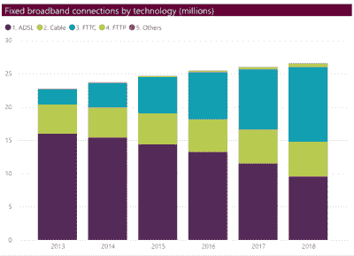
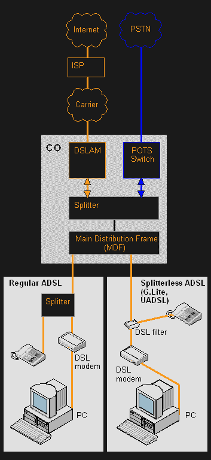
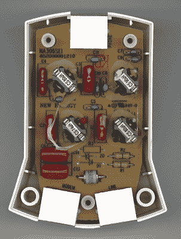

# 随着电信公司停止销售新服务，DSL 几乎岌岌可危

> 原文：<https://hackaday.com/2020/10/29/dsl-is-barely-hanging-on-the-line-as-telcos-stop-selling-new-service/>

你现在是通过美国电话电报公司数字用户线阅读这篇文章吗？如果是这样的话，你可能不得不升级或者尽快找一个新的 ISP。在& T 在 10 月 1 日悄悄地停止销售新的传统 DSL，尽管他们将继续销售他们升级的光纤到节点版本。这留下了一个巨大的数字鸿沟，因为 AT & T 的 21 个州中只有 28%的地区建成了完全光纤到户，该公司表示，他们已经完成了几乎所有的光纤扩张计划。AT & T 公司升级的 DSL 服务是光纤和铜缆的混合，光纤终止于离用户家最近的网络节点，本地环路仍然通过铜缆或同轴电缆。

几乎在同一时间，一份由美国通信工人联盟和一个数字包容倡导组织的成员联合撰写的报告出炉了。该报告称，AT & T 将富裕地区和非农村地区作为全面光纤升级的目标，而将该国其他地区蒙在鼓里。

 随着互联网将这些前所未有的时代粘合在一起，这一消息对于许多试图通过各种视频会议服务工作、上学和看病的农村客户来说犹如当头一棒。

如果你住在一个足够大的城市，你可能已经有 20 年没有想过 DSL 了。得知 ADSL 在英国如此普及，你可能会感到惊讶。ADSL 在 2017 年之前是英国宽带的主要来源，已经被光纤到户(FTTC)连接的兴起所抵消。然而，[这份 Ofcom 报告](https://www.ofcom.org.uk/research-and-data/multi-sector-research/cmr/cmr-2019/interactive)显示，2018 年 ADSL 仍然占英国所有宽带连接的三分之一以上。

为什么人们还留着它，当它干涸时，他们在美国应该做什么？

## DSL 到底是什么？

Regular and splitterless ADSL. Image via [The Free Dictionary](https://encyclopedia2.thefreedictionary.com/DSL)

DSL 代表数字用户线路，本质上是铜缆互联网。直到 20 世纪 90 年代中期，许多人使用不同波特率的调制解调器访问互联网，包括我自己。为了使用调制解调器，人们必须在这段时间内占用电话线。

当 DSL 问世时，它不仅比你在大盒子商店里买到的最快的调制解调器还要快，你还可以一边使用 DSL 一边打电话。我个人从来没有过 DSL。它们很贵，当我为自己的互联网付费时，电缆调制解调器在美国越来越受欢迎。它们每月的费用差不多，但被吹捧为比 DSL 更快。无论如何，我想要有线电视，所以它是有意义的。

[DSL 的工作频率高于语音频率，因此它可以与语音线路共存于铜线上](https://hackaday.com/2016/02/05/grandmas-phone-dsl-and-the-copper-they-share/)。为了防止 DSL 频率溢出并回响到语音呼叫中，有模拟低通 DSL 滤波器、分离器和分离线路的组合滤波器-分离器。在它们到达更广阔的互联网之前，DSL 在中心局被聚集成数字用户线接入复用器(DSLAM ),然后被馈送到交换机。

## DSL 口味

当人们谈到现代 DSL 时，他们通常指的是异步 DSL 或 ADSL。下载速度从 5-35 Mbps 不等，上传速度平均为 1-10 Mbps。不对称在于数据吞吐量:上传速度比下载速度慢，因为人们通常下载比上传多。

在同步 DSL (SDSL)中，吞吐量是对称的。还有 VDSL 和 VDSL2 —两层超高速 DSL。VDSL 下行速度可达 52Mbps，上行速度可达 16Mbps，VDSL2 最大双向速度约为 100Mbps。

This DSL filter-splitter will keep high frequencies out of your phone calls. Image via [Wikimedia Commons](https://en.wikipedia.org/wiki/DSL_filter#/media/File:DSL-filter-splitter-circuit-0a.jpg)

DSL 也有“湿”和“干”之分。如果你有一个湿的 DSL，铜线对也能传送声音。一个干巴巴的 DSL 只有 DSL。这个术语来自早期的语音电路，当你拿起电话拨号时，它需要电池来检测。干环线没有连接到电池，并从中心局获得他们需要的所有电力。

## 把人们留在黑暗中

CWA 和 NDIA 的报告还指责美国电话电报公司在城市中心的“数字红线”,这实质上有利于像克里夫兰和底特律这样的城市的富人，因为这些城市的光纤建设受到关注。美国电话电报公司自然否认任何所谓的红线活动。

一些城市用户足够幸运，有其他选择，如有线电视、光纤或卫星接入。但农村地区的许多人没有逛商店的奢侈。在美国电话电报公司离开或已经离开的地方，订户被迫从现有的有线电视公司或任何其他可用的地方购买。他们没有闲心去寻找最好的交易或者最快的连接。

## 暗铜色

美国电话电报公司不是唯一放弃 DSL 的国家。威瑞森正在扼杀所有有光纤服务的地方，没有新客户可以在 FiOS 购买 DSL。许多人仍然依赖普通的老式 DSL，现在是抛弃这些客户的糟糕时机。同样令人遗憾的是[如此多的铜被留在自然环境中腐烂](https://hackaday.com/2020/10/12/ask-hackaday-with-landline-use-in-decline-whats-to-be-done-with-the-local-loop/)，而这些铜本可以被市政当局接管，他们可以使用这些线路来确保每个仍有铜的家庭都能有某种形式的互联网接入。

那么，黑客日，我们能通过老式的美国电话电报公司 DSL 联系到你吗？你有什么计划？如果你有 DSL 并且不受此影响，你会怎么想？如果没有别的，DSL 是健壮的:[它甚至可以在湿的钻柱上运行](https://hackaday.com/2017/12/14/adsl-robustness-verified-by-running-over-wet-string/)。