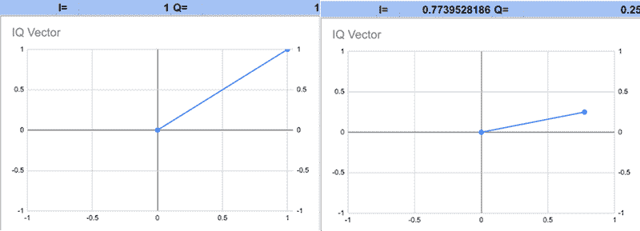
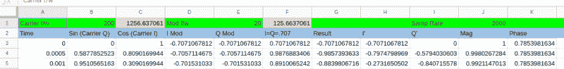
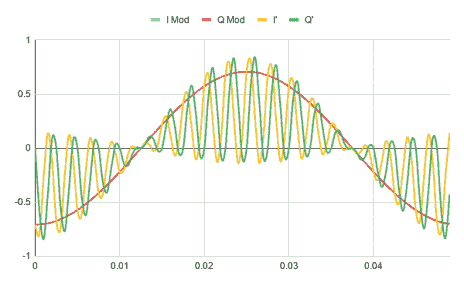
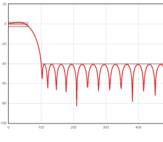
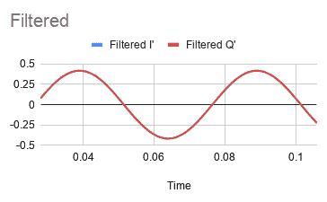
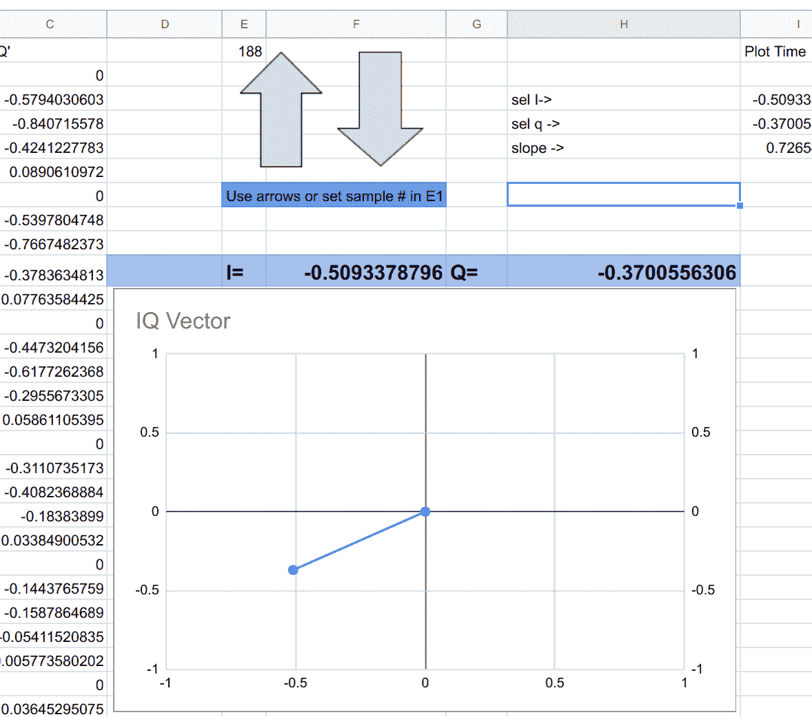

# DSP 电子表格:用智商与自己对话

> 原文：<https://hackaday.com/2019/11/29/dsp-spreadsheet-talking-to-yourself-using-iq/>

我们用 Google Sheets 和信号处理做了很多工作:我们生成了信号，创建了滤波器，并计算了正交信号。我们可以将所有这些整合到一个教育模型中，让两个 SDR 相互对话，但这需要两个部分:调制和解调。你猜怎么着？我们可以用电子表格来做。

第一步是为载波产生参考时钟。你需要一个余弦波(I)和一个正弦波(Q)。当然，你还需要时间基础。这是电子表格中的 A-C 列，其工作原理与我们见过的其他信号发生器类似。

## 事情变得复杂了

想想我们目前所拥有的智商图。画智商就是把 I 放在图的 X 轴，Q 放在 Y 轴。当 I=1 时，Q=0。这是 X 轴上的一个点，X=1。同样的事情发生了，但是在 I=-1 时翻转了。当 I=0 和 Q=1 时也会发生，但旋转了 90 度。关键是，在每种情况下，向量的长度都是 1。事实上，每个点的长度都是 1，因为 sin²(x)+cos²(x)= 1。如果您用默认值查看电子表格的前 12 行，您会看到 X 和 Y 在 1 和-1 之间移动，这样它们的平方和总是 1。

那是什么意思？这意味着 IQ 参考信号将在 IQ 图上画一个半径为 1 的圆。如果我们把两者乘以相同的量，半径会改变，但你仍然会得到一个圆。那是调幅。你也可以考虑一些其他的事情。例如，如果 I 和 Q 完全相同(在电子表格中很容易改变；只要将两列都设置为正弦或余弦)，相位角将总是 45 度或 225 度。幅度总是 2 的平方根(假设原始信号从-1 到 1)。将两者乘以相同的数会改变信号的幅度，但不会改变相位。

将智商的一部分乘以某个数字，而不是另一部分，将导致相位的变化。想象一下图中 I 和 Q 成 45 度角的那部分——也就是说，I=Q，如果你让 Q 变大，它必然会改变矢量的角度。因此，通过控制参考 IQ 信号，我们可以实现幅度调制或相位调制，改变相位也可以实现频率调制。

## 经受考验

在现实生活中，你可能有两个站都使用 DSP 技术来发送和接收。在这种情况下，发射机产生一个参考 IQ 信号，对其进行处理，最终向天线输出一个 RF 信号。

接收方无法确定发送站是否在使用 DSP，但这并不重要。信号是一样的。接收器将产生自己的 IQ 参考信号，并进行反向转换。算是吧。问题是，没有办法知道发射器的参考信号是否与接收器的信号同相。然而，相对相位是相同的，这是你所关心的，如果你关心相位的话。

还有一个问题。当你恢复信号时，它将与你需要过滤掉的更高频率的信号混在一起。幸运的是，我们已经知道如何去做。

## 在床单上

以下是如何阅读[电子表格](https://docs.google.com/spreadsheets/d/1OGWoEYtg4NgEN1SRJboo5KwSP88-QPS-YblCXir75po/edit?usp=sharing)。主选项卡是大部分操作所在的地方。可以在顶部设置常用参数。前三列是时基和 IQ 参考信号。我也会在接收端欺骗和重用这些。如果你想证明如果参考信号不同相，它仍然可以工作，你可以很容易地进行修改。

直到 G 列的其余列正在调制 IQ 基准电压。产生的“无线电”信号在 g 列。这既是发射机的输出，也是接收机的输入。

接收器位于 H 列和 I 列，因为我重复使用了时基和参考信号。如果观察输入信号和输出的曲线图，就会看到我提到的高频成分。

    

请注意，I 和 Q 上的调制信号是相同的，因此您只能看到 Q 信号(蓝色 I 信号正下方)。尽管您可以看到低频与调制信号相匹配，但您可以切换到第二个选项卡来滤除高频成分。

 那张纸用的是我们之前讲过的 [FIR 滤波技术](https://hackaday.com/2019/10/03/dsp-spreadsheet-fir-filtering/)。该滤波器的通带范围为 0 Hz 至 60 Hz，阻带始于 100 Hz。您可以看到部分增益与频率的关系图。共有 57 个抽头，因此当算法加载数据时，我们会错过前 57 个样本。

当然，滤波器会偏移信号的相位，并错过前几个样本，因此时间轴不会对齐，但这无关紧要。没有同步的 IQ 参考，相位校准就没有任何希望。

## 最终标签

最后一个选项卡获取数据，并允许您对任何样本进行矢量图绘制。我作弊使用了一个脚本来启用大箭头按钮，所以你可能需要在它工作之前授予权限。然而，如果你不介意手动改变细胞 E1，你不需要这些按钮。让电子表格生成漂亮的矢量图需要做一些工作:

## 老实说…

在某种程度上，你可以在一个电子表格中做这么多的建模工作，这是令人惊讶的。如果你是认真的，你真的应该考虑使用类似于 [Juypter](https://hackaday.com/2019/02/22/drops-of-jupyter-notebooks-how-to-keep-notes-in-the-information-age/) 或者——老实说——其他任何东西。然而，如果你想学习 DSP 的概念，必须先学习一个新的工具可能会相当令人生畏。

仅仅使用一个电子表格，你就可以用这个模型来思考在某些情况下会发生什么。一旦你超越了它，你就可以转向像 MATLAB 或者它的众多复制品，或者用 C、Python 或者你选择的任何语言来处理你的代码。