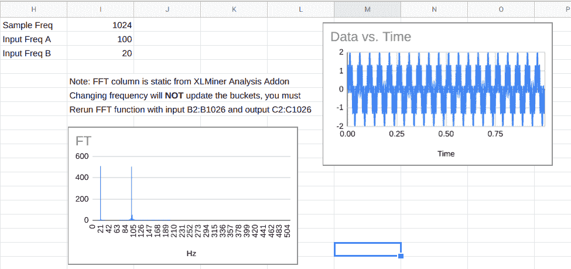
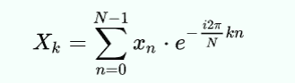
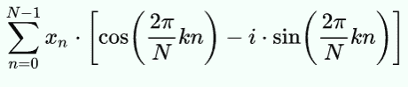
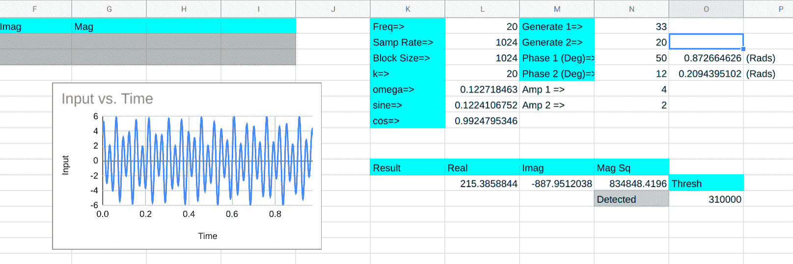

# DSP 电子表格:Goertzel 算法是傅立叶的更简单的表亲

> 原文：<https://hackaday.com/2020/11/13/dsp-spreadsheet-the-goertzel-algorithm-is-fouriers-simpler-cousin/>

您可能至少对傅里叶变换略知一二，傅里叶变换是一种将时域信号转换为频域信号的数学过程。具体来说，对于计算机，我们没有一个很好的方程，所以我们使用离散形式的变换，以固定的间隔进行一系列测量。如果你需要了解一个信号的整个频谱，或者你想过滤信号的一部分，这绝对是工作的工具。然而，有时它超出了你的需要。

例如，考虑给吉他弦调音。你只需要知道一个频率是否存在。如果您正在解码按键音，您只需要知道八个频率中的两个是否存在。其他的你都不在乎。

傅立叶变换可以完成这两项工作。但是如果你走这条路，你将会做大量的数学运算来计算你不关心的东西，这样你就可以挑出一两件你关心的东西。这就是 Goertzel 背后的想法。它本质上是一种快速傅立叶变换算法，只需计算一个感兴趣的频带。数学要简单得多，而且通常可以比完全转换实现得更快更小，甚至在小型 CPU 上也是如此。

## 傅立叶评论

回顾一下，使用傅里叶变换的典型系统将使用模数转换器以某个时钟频率读取多个样本。例如，您可能在 1 MHz 下读取 1024 个样本。每个样本都比前一个样本晚 1 微秒，您将获得一毫秒多一点的数据。

转换还将产生 1024 个结果，通常称为桶。每个桶将代表 1 MHz 的 1/1024。由于奈奎斯特频率限制，结果的上半部分用处不大，因此实际上，前 512 个桶代表 0 Hz 至 500 kHz。

这里有一个[电子表格](https://docs.google.com/spreadsheets/d/1mpkjLjZ8jjpOojN2mFsjbnDP2IO9SAFrjMDxENy-gyE/edit?usp=sharing)(毕竟，这是 DSP 电子表格系列文章)使用 [XLMiner 分析插件](https://gsuite.google.com/marketplace/app/xlminer_analysis_toolpak/600284989882)进行傅立叶变换。采样频率为 1024Hz，因此每个桶(G 列)的值为 1 Hz。B 列产生两个正弦波，频率分别为 100 Hz 和 20 Hz。我们去年讨论过[产生像这样的信号](https://hackaday.com/2019/11/01/dsp-spreadsheet-frequency-mixing/)。

[](https://hackaday.com/wp-content/uploads/2020/09/fft.png)

C 列中的 FFT 数据是复数，它们不会实时更新。如果你改变频率，你必须使用 XLMiner 插件重新计算。数字的幅度显示在 F 列中，您会看到对应于两个输入频率的桶比其他桶高得多。

## 许多桶中的一桶

如果我们的目标是找出信号中是否包含 100 Hz 信号，只要知道如何计算，我们就可以计算单元 F102。那正是 Goertzel 所做的。以下是离散傅立叶变换中每个桶的实际公式(由维基百科提供):

[](https://hackaday.com/wp-content/uploads/2020/09/math.png)

如果你应用欧拉公式，你会得到:

[](https://hackaday.com/wp-content/uploads/2020/09/math2.png)

数学上，N 是块大小，k 是感兴趣的桶号，x [n] 是第 N 个样本。因为 N 从 0 到 N-1 不等，所以您可以看到这个表达式使用所有数据来计算每个 bucket 的值。

那么，诀窍就是找到计算一个桶所需的最少步骤数。请记住，对于一个完整的转换，您必须对每个桶进行这种计算。这里我们只需要做一个。然而，你必须总结所有的事情。

## 不绕圈子直截了当地说

如果你做一点操作，你可以把它简化为以下步骤:

1.  预计算以弧度表示的频率比，即 2πk/N
2.  计算你在步骤 1 中找到的值的余弦值(称之为 C)；还要计算正弦值(称之为 S)
3.  对于序列中的每个桶，取前一个桶(P)和前一个桶(R)的值，计算桶=2*C*P-R，然后加上当前输入值
4.  现在，最后一个桶将被设置为接近第 k 个桶的值。要找到实部，将最终桶乘以 C，然后减去 p。对于虚部，将 S 乘以最终桶值
5.  现在你想求由实部和虚部构成的复数的幅度。如果你转换到极坐标符号，这很容易做到(找到由实部和虚部形成的三角形的斜边)。

当然，[也有一个电子表格。由于电子表格的局限性，它会做很多额外的计算，所以为了弥补这一点，D 列隐藏了所有无关紧要的行。在一个真实的程序中，除了最后一次循环(也就是在每一行)之外，你不需要做那些计算(比如列-列)。您需要一些样品来灌注泵，所以前两行是灰色的。](https://docs.google.com/spreadsheets/d/1ETvhZM02maPIAx94Wli8fcmI0l7yq_-8cUt3atNslhc/edit?usp=sharing)

[](https://hackaday.com/wp-content/uploads/2020/09/gtz.png)

你还可以做其他的优化。例如，余弦项在每次循环中都会加倍，但在最终计算中不会。在一个真实的程序中，你只需要做一次计算，但是对于一个小的电子表格，没有太大的区别。

当然，B 列是输入数据。列 C 是桶的运行总数。最后一行的列 E-G 表示得到桶 k 的复杂结果的最终计算。真正能找到结果的地方在 L11 左右。第 11 行的这一部分拾取了列 E-G 的一个可见部分，并且也平方了幅度，因为我们正在寻找功率。还有一个阈值和一个单元告诉你频率(在 L1)是否存在。

尝试改变产生的频率，你会发现它可以很好地检测 20 赫兹附近的频率。您可以调整阈值以获得更紧或更宽的响应，但 20 Hz 和 19 或 21 Hz 之间的差异非常明显。

## 真实代码

由于电子表格并不能给你一种感觉，告诉你在传统的编程语言中是如何做的，这里有一些伪代码:

```

omega_r = cos(2.0*pi*k/N);
omega_r2=2*omega_r;
omega_i = sin(2.0*pi*k/N);

P = 0.0;
S = 0.0;
for (n=0; n<N; ++n)
{
   y = x(n) + omega_r2*P -S;
   S = P;
   P = y;
}
realy = omega_r*P - S; // note that hear P=last result and S is the one before
imagy=omega_i*P;
magy=abs(complex(realy,imagy));  // mag=sqrt(r^2+i^2);

```

因为您可以在循环之外预先计算所有的东西，所以即使在一个简单的处理器中，这也很容易用公式表示。如果你只是做比较，并且无论如何都想求结果的平方，你甚至可以跳过平方根。

## 权衡

别忘了，一切都是交易。采样速率和样本数量决定了读取每个样本需要多长时间，也决定了桶的频率范围有多宽。如果您必须探测许多频率，那么使用实现良好的傅立叶变换库可能会更好。

还有其他方法可以优化这两种算法。例如，您可以通过选择正确的采样速率和块大小来限制处理的数据量。或者，不使用傅立叶变换，考虑不使用复数的[哈特利](https://en.wikipedia.org/wiki/Discrete_Hartley_transform)变换。

## 在实践中

我非常怀疑是否有人需要在电子表格中做这种逻辑。但是像其他 DSP 电子表格模型一样，用这种方式设计的算法很容易检查和试验。培养对算法的直觉至少和死记硬背一样重要——也许甚至更重要。

对于许多常见情况，Goertzel 是避开更复杂算法的简单方法。这是一个你应该拥有的工具。