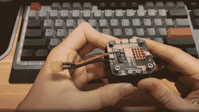
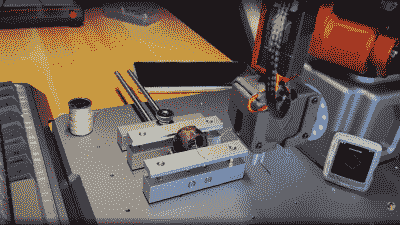

# 机器人手臂并不笨

> 原文：<https://hackaday.com/2022/02/21/dummy-the-robot-arm-is-not-so-dumb/>

[智慧君]是一个你会想要记住的名字，因为这个中国制造商创造了我们见过的最完整的开源机器人手臂之一。这个项目必须亲眼看到才会相信。设计的每个方面，从概念、机械 CAD、电子设计和软件，包括嵌入式、3D 图形用户界面等等，都是一个制作者在业余时间完成的！听起来我们说得太多了？就看视频，努力跟上！

在对玩具机器人与更多工业单元进行初步评估后，很快就认定伺服系统无法满足要求——扭矩太小，而且不够精确。当与一个好的控制器配对时，BLDC 电机可以提供很高的精度和扭矩，但它们很难做得足够小，所以选择了现成的紧凑型谐波驱动器，并与步进电机配对，以获得所需的性能。这是乘以 6，并下降到一些光滑的数控加工铝零件，以完成机械。定制的闭环步进控制器直接安装在每个电机的后部。那也很好。

Stepper controller mounts on the motor rear – smart!

控制电子设备基于 STM32，使用 ESP32 进行 Wi-Fi 连接，但视频的速度太快了，很难跟上设计的进度。有一个简短的提及，控制器为[鸿蒙系统](https://www.harmonyos.com/en/)运行 LiteOS 内核，但我们找不到任何细节。[项目 GitHub 有许多血淋淋的细节要仔细研究](https://github.com/peng-zhihui/Dummy-Robot)，也许有些地方有点轻松，但承诺会扩展它。对于远程控制，有一个与 BLE 连接的教学设备(称为“峰”)与触摸屏，再次细节待定。哦，我们有没有提到有一个力反馈(PS5 自适应触发器必须为此而死)远程控制单元，它使用双目相机来跟踪运动，AHRS 设置给出方向，所有这些都是由华为 Atlas edge 人工智能处理系统提供动力的？这在视频中被大大掩盖了，就像它只是一些不值得谈论的旁注。我们希望细节能尽快公之于众！

Threading a needle through a grape by remote control

专用的 GUI，看起来像是用 [Unity](https://unity.com/) 编写的，允许机器人编程和运动规划，但由于那些谐波驱动器是反向驱动的，机器人可以用手移动，并记录运动以便以后重放。AR 的一些工作已经开始，但看起来像是在过程的早期，功能只是不断出现！

坦率地说，发生了这么多事情，很难在这里总结，也很难对这个项目做出任何公正的评价，因此，我们建议到 YT 来亲自看看。

我们喜欢这些部件周围的机器人，尤其是机器人手臂，这里有一个由[Jeremy Fielding] 制作的[大机器人，如果你认为步进电机是不必要的，因为](https://hackaday.com/2021/04/10/scratch-built-robot-arm-looks-like-something-off-the-factory-floor/)[伺服电机可以工作得很好](https://hackaday.com/2021/03/19/robot-arm-achieves-amazing-accuracy-with-just-servos/)，你可能是对的。

 [https://www.youtube.com/embed/F29vrvUwqS4?version=3&rel=1&showsearch=0&showinfo=1&iv_load_policy=1&fs=1&hl=en-US&autohide=2&wmode=transparent](https://www.youtube.com/embed/F29vrvUwqS4?version=3&rel=1&showsearch=0&showinfo=1&iv_load_policy=1&fs=1&hl=en-US&autohide=2&wmode=transparent)

感谢[djtano]的提示！