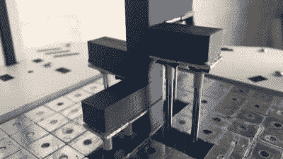

# 3D 打印机的动态构建平台消除了支撑并节省了材料

> 原文：<https://hackaday.com/2021/04/10/dynamic-build-platforms-for-3d-printers-remove-supports-and-save-material/>

我们都太熟悉 3D 打印后处理步骤，即移除支架，并感叹塑料在另一个不断缩小的灯丝卷轴上的浪费。当材料是昂贵的 NinjaFlex 或异国情调的生物打印机时，打印支持是彻头彻尾的痛苦。南加州大学的一个小组想出了一种新的方法，通过随着时间的推移抬高床的一部分来显著减少 3D 打印材料的数量，这让我们想知道为什么不经常做一个更简单的版本。

在南加州大学的版本中，床有一堆方形扁平金属片，每个金属片下面有一根金属管。管子的长度决定了正方形的最终高度。在打印之前，通过在正确的方块中插入适当长度的管来准备床。然后，在打印过程中，单个马达推动平台上升，根据针的高度，床的这一部分适当上升，然后停在正确的高度。

 这比用线性马达或伺服系统矩阵来控制每一个方格节省了很多钱，但代价是每次印刷都要准备图钉。

但是这让我们想知道:既然 CURA 和其他切片软件能够在一定高度暂停，那么如果切片软件能够允许放置已知大小的垫块会怎么样呢？用户将有各种可重复使用的间隔块，并将它们放置在软件中，切片机将从块的顶部开始构建支撑材料。它可以在基层上打印一个矩形，以帮助在打印过程中正确放置块，并在正确的高度暂停以让用户插入块。在印刷结束时，使用了少得多的支撑材料。

如果你想让你的印刷品无人看管，或者如果材料的成本足够低，不值得这样做，那么也许这是不值得的。另一个问题可能是加热平台，尽管由于只有支撑材料会印在上面，一些卷曲不会有太大影响。你怎么想呢?

 [https://www.youtube.com/embed/0BupCUV9YQs?version=3&rel=1&showsearch=0&showinfo=1&iv_load_policy=1&fs=1&hl=en-US&autohide=2&wmode=transparent](https://www.youtube.com/embed/0BupCUV9YQs?version=3&rel=1&showsearch=0&showinfo=1&iv_load_policy=1&fs=1&hl=en-US&autohide=2&wmode=transparent)

