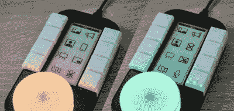

# 动态宏键盘控制所有的东西

> 原文：<https://hackaday.com/2021/02/18/dynamic-macro-keyboard-controls-all-the-things/>

键盘快捷键很棒。即便如此，一个人在用 Zoom 进行演示时，也只能记住这么多快捷方式，并准确地点击它们。[Sebastian]需要一套好的 OBS 快捷键，决定做一个宏键盘来帮忙。[当他完成时，[Sebastian]已经对所有的东西进行了宏处理，并构建了一个漂亮而智能的外设](https://there.oughta.be/a/macro-keyboard)，任何有脉搏的人都可能喜欢将它放在他们的办公桌上。

 设计从 OBS 开始，但这个滑头的小键盘变成了全系统的助手。它根据具有焦点的程序动态分配八个键，甚至更新图标以显示麦克风状态等变化。

这是通过 PC 上的 Python 脚本完成的，该脚本监控正在运行的程序，并使用[Sebastian]编写的串行协议相应地更新宏 keeb。由于这种设计的灵活性，[Sebastian]甚至可以用它来控制 MQTT 上的办公室灯，并在空气中出现问题时，让 CO2 监视器向滚轮发送颜色编码警告。

这个项目是完全开放的，有着令人难以置信的文档，[Sebastian]渴望看到人们提出的改进和替代的外壳材料。休息之后，请务必观看走查/构建视频。

想自己动手制作，但又想从小处着手？这里有很多值得欣赏的东西。

 [https://www.youtube.com/embed/nndeAxd5FdM?version=3&rel=1&showsearch=0&showinfo=1&iv_load_policy=1&fs=1&hl=en-US&autohide=2&wmode=transparent](https://www.youtube.com/embed/nndeAxd5FdM?version=3&rel=1&showsearch=0&showinfo=1&iv_load_policy=1&fs=1&hl=en-US&autohide=2&wmode=transparent)

