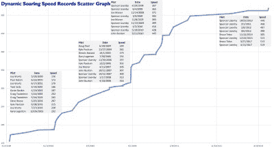
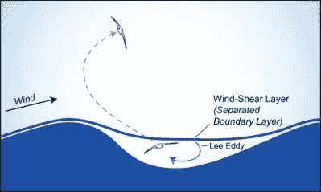

# 动态翱翔:时速 545 英里的遥控飞机没有发动机

> 原文：<https://hackaday.com/2020/09/24/dynamic-soaring-545-mph-rc-planes-have-no-motor/>

有史以来最快的遥控飞机飞行发生在 2018 年，最高时速为 545 英里/小时。也就是 877 km/h，或者说 0.77 马赫！

是什么限制因素阻止了飞行员兼设计师斯潘塞·李森比的飞机飞得更快？机翼部分的气流撞击音障，由此产生的迷你音爆对空气动力学造成严重破坏。什么样的增压喷气发动机可以推动模型飞机比它的翅膀携带它更快？绝对没有；令人惊讶的是，最快的遥控飞机是滑翔机。

动力滑翔在 20 世纪 90 年代中期首次用于推动模型飞机。从那以后，飞行员之间的非正式国际竞赛把这项技术推向了更远的地方，在短短 20 年里，最高测量速度增加了两倍多。但是动态翱翔一点也不新鲜。事实上，自从地球上有风和斜坡以来，这是可能的。信天翁，动物王国的长途冠军，一直在“DSing”，我们已经知道它一个世纪了。

DS 是模型飞行的最高技术前沿，充满了有趣的物理现象和工程挑战。到目前为止，这些飞机都是由人遥控驾驶的，但达到新的高速可能需要机载硅的快速反应时间，以及新一代的飞机设计。当条件合适时，滑翔机可以从动态滑翔中获得的“自由”速度提升可以扩展无人机的航程。简而言之，DS 正处于一个转折点，事情即将变得非常有趣。是时候让你了解动态翱翔了。

## DS 的物理学

当风吹过一座山时，它不得不越来越高，重点是“向上”。滑翔机飞行员长期以来一直使用这种*山脊升力*来为自己创造优势，而模型飞机在小山前侧的山脊升力中无限滑行的练习被称为“斜坡滑翔”。有了无限的升力来源，模型滑翔机可以用很少的动力做各种有趣的杂技，只要它们不撞到山上或飞到山的背面。

 在背面，空气又被拉回下方，在上方移动的空气和静止的山谷中的风影之间有一个奇怪的湍流区。众所周知，背面会吃掉模型飞机，先把它们往下拉一点，然后让它们翻滚，然后让它们慢慢沉入静止的空气中。如果你幸运的话，要走很长一段路才能找到完好的飞机。如果你运气不好，你可以在山的背风面收集你的棋子。

直到有一天，杰出的滑翔机飞行员(也是航空工程师)乔·伍茨飞了起来。他意识到他无法顶着强风返回，也不想徒步下山，于是他将飞机瞄准了谷底。它加快了速度，穿过了湍流区，进入了静止的空气中，在那里他能够将它飞回山顶，因为他没有对抗强烈的逆风。当它爬升并重新进入气流时，他注意到它加快了速度。然后[他开始故意这样做](https://www.charlesriverrc.org/articles/flying/dynamicsoaring.htm)。

由此诞生了遥控滑翔机的动力滑翔。(Ta-daa！)一开始看起来像是永动机，但诀窍在于，每次飞机重新进入快速移动的空气时，都会受到顺风的推动。潜入静止的空气让它飞回到它开始的地方，而不会受到相反方向的同等推力。只要飞机在返航过程中受到的推力大于阻力，它就会带着更多的能量飞出圆圈——它会飞得更快。

## 速度惊人的模型飞机

 [https://www.youtube.com/embed/MoaWlKC3wIM?version=3&rel=1&showsearch=0&showinfo=1&iv_load_policy=1&fs=1&hl=en-US&autohide=2&wmode=transparent](https://www.youtube.com/embed/MoaWlKC3wIM?version=3&rel=1&showsearch=0&showinfo=1&iv_load_policy=1&fs=1&hl=en-US&autohide=2&wmode=transparent)

而快就是*快*。速度记录的进步停滞了许多年，因为没有商用的雷达枪可以测量超过 300 英里/小时的速度——与碳纤维遥控滑翔机相比，超级跑车的速度很慢。当更好的雷达探测器变得可用时，很大程度上是由于斯潘塞和 DS 社区的不断纠缠，测得的速度急剧上升——这是图表中间的垂直线。

 当这项运动还年轻的时候，最高可达到的速度受到翅膀硬度的限制:*颤振*是翅膀杀手。如果机翼开始高速振动，就会有大量的能量来保持它的放大，结果是机翼自身撕裂或者脱离机身。

现代飞机有抗颤振的机翼设计，但也由碳纤维和其他高科技复合材料制成。与“普通”滑翔机不同，DS 滑翔机有一个令人羡慕的问题，即面临太多的风能，因此它们可以建造得很坚固，而不必担心太多的重量。

今天，最高速度的极限是空气动力学和人类飞行员。越过机翼顶部的空气必须穿过音障，在那里它不再是可压缩的。这会在机翼中间产生冲击波，从而降低其空气动力学效率。与全尺寸飞机一样，解决方案是向后扫机翼。这消除了机翼上的压力梯度，但这意味着飞机的整个重新设计。这是斯潘塞下一个设计的方向。

如果你想了解动态滑翔的最新进展，你真的应该去看看斯潘塞的演讲。如果你只是关心飞机，他自己设计的历史[在](https://youtu.be/nv7-YM4wno8?t=1241)开始大约 20 分钟。

 [https://www.youtube.com/embed/nv7-YM4wno8?version=3&rel=1&showsearch=0&showinfo=1&iv_load_policy=1&fs=1&hl=en-US&autohide=2&wmode=transparent](https://www.youtube.com/embed/nv7-YM4wno8?version=3&rel=1&showsearch=0&showinfo=1&iv_load_policy=1&fs=1&hl=en-US&autohide=2&wmode=transparent)

当斯潘塞设法设计并制造出一架可以接近音障的飞机时，下一个限制因素可能是回路中的人。在速度已经超过 200 米/秒的情况下，人的反应和决策时间大约为 250 毫秒到 500 毫秒，相当于 100 米的飞机行程。如果一架飞机在距离地面仅 20 米的时候以这样的速度遇到严重的湍流，在任何人有机会眨眼之前，它就可能是碳纤维灰尘。引用斯潘塞的话，“每一个新的速度，你都会有这种感觉，就像你在你的头上，你的大脑跟不上发生的事情。”

虽然我们还没到那一步，但再过 20 年，最快的 DS 飞机可能会更加自动化，因为人类跟不上。这带来了一系列新的挑战，从仪器仪表和电机到算法设计。在更广泛的模型飞机爱好中，有大量的自动驾驶系统可用，例如 [Ardupilot](https://ardupilot.org/) ，但它们都没有跨音速 DS 所需的闭环响应时间。但是他们比人快。

## 信天翁、无人机和风车

 瑞利勋爵首先注意到信天翁不用拍打翅膀就能长距离飞行。他称这为“阵风翱翔”。但反常的是，直到模型飞机的 DS 革命之后，我们才开始完全理解空气动力学，在这方面我们仍然有很多东西要向大自然学习。

信天翁的翅膀上有一系列的张力和风速传感器，可以实时分析和控制它的飞行，这是我们无法接近的。据报道，即使在睡觉时，它们也能随着海浪翱翔，翼尖掠过水面仅几厘米。

也许动力滑翔的一个未来应用将是无人机，它通过采集风速梯度来节省能量，无论是在海洋上还是利用特定的地形。我们很想听到安静的 DS 机器人取代他们吵闹的直升机兄弟。想象一下，当滑翔机接近一座多风的小山的背风面时，它们会沿着自己的路线停下来，绕圈加速，然后继续前进到下一个地方。结合公寓上方的热提升源或太阳能，你可能会有所收获。

但是在我们的头脑迷失在云里之前，让我们回到物理学上来。你可能会想“嘿，既然有这么多免费的能源，为什么我们还不去收集呢？”动态滑翔的“动态”部分来自于顶部转弯:飞机只有在快速移动的空气中才能获得能量。循环的下半部分只是回到它开始的地方。如果你不需要去任何地方，你可能会想象跳过低效的返回路径，通过用一根高高的桅杆将飞机拴在地面上，将能量收集效率提高一倍。让机翼带动一台发电机，也许用三台，你就发明了现代风车，它的效率至少是最好的 DS 飞机的两倍。

因此，也许动态滑翔的未来就像现在一样:一项充满肾上腺素、空气动力学和不缺乏设计挑战的有趣运动。或者也许你的未来*就是[发现 DSing](https://www.rcgroups.com/dynamic-soaring-126/) 。在竞争激烈的碳飞机的高成本的另一个世界里，你可以几乎不花一分钱就开始用[DIY 泡沫模型](https://www.rcgroups.com/forums/showthread.php?1456458-Wisel-just-the-glider-you-need)或者干脆[奶酪出来买一个](https://www.jwglider.com/)。初学者模型是惊人的强大，如果你破坏了它，你可以把它粘在一起，或者收获伺服电机，重新开始。快乐翱翔！*