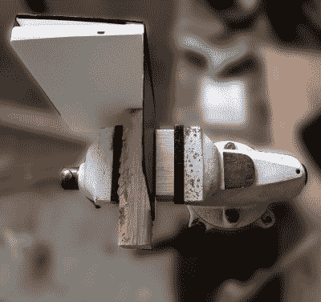

# 使用 3D 打印印章轻松压印笔记本

> 原文：<https://hackaday.com/2018/12/09/easily-deboss-notebooks-with-a-3d-printed-stamp/>

虽然可以说它更接近于制作领域的“艺术和手工艺”领域，我们通常不会因为 l33t 的优越感而涉足这一领域，但我们不得不承认，[Sean Hodgins] 展示的[快速简单的笔记本定制非常引人注目。我们不再像过去那样频繁地给枯树涂上墨水，但如果我们这样做的话，也可以像海明威那样，用一个黑色的小笔记本。](https://imgur.com/gallery/0s9yJXI)

 如休息后的视频所示，流程从在您选择的 CAD 包中设计图章开始。为了获得最佳效果，[Sean]建议使用相当大的大写字母，但是通过练习，你应该能够使用一些更有创意的字体。潜在地，你甚至可以使用你最喜欢的黑客博客的标志，但是我们是谁来决定你做什么？

无论你选择什么，它都需要被镜像并放置在相对较厚的衬底上。他推荐一个 2 毫米厚的“盘子”,上面有凸起的字母。你会希望以较高的填充率打印它，但即使如此，它也不应该花费超过 30 分钟左右的时间。请记住，超过 50%后，填充的回报往往会递减，所以一直到 100%不会有太大作用，但会花费更多的时间和塑料。

印刷完成后，[Sean]会将邮票热粘在一块木头上，因为直接对印好的邮票施压可能会使邮票破裂。接下来就是把你的笔记本、印好的邮票和木块放到一个合适的结实的台钳上。让一切都保持一致是一件说起来容易做起来难的事情，所以在你掌握它之前，先做好弄乱第一对的准备。

当校准看起来不错时，转动曲柄，让它静止几分钟。如果你要把图案压印到真正的皮革上，在施压前先湿润一下应该会有帮助。最终效果是低调的，但不可否认非常光滑；随着假期的临近，这可能是挑选一些合情合理的礼物的好方法。

最终，这里的想法是一个轻量级版本的用于弯曲铝的 3D 打印冲压模具或用于钢板的 T2 冲头和模具。在这一点上，似乎有足够的证据表明，3D 打印物体肯定足够强大(至少在压缩状态下)，可以放入一些合法的作品。

 [https://www.youtube.com/embed/mPIOGmVp_cM?version=3&rel=1&showsearch=0&showinfo=1&iv_load_policy=1&fs=1&hl=en-US&autohide=2&wmode=transparent](https://www.youtube.com/embed/mPIOGmVp_cM?version=3&rel=1&showsearch=0&showinfo=1&iv_load_policy=1&fs=1&hl=en-US&autohide=2&wmode=transparent)

