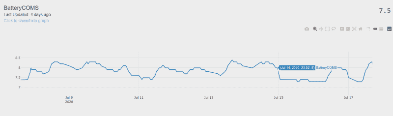
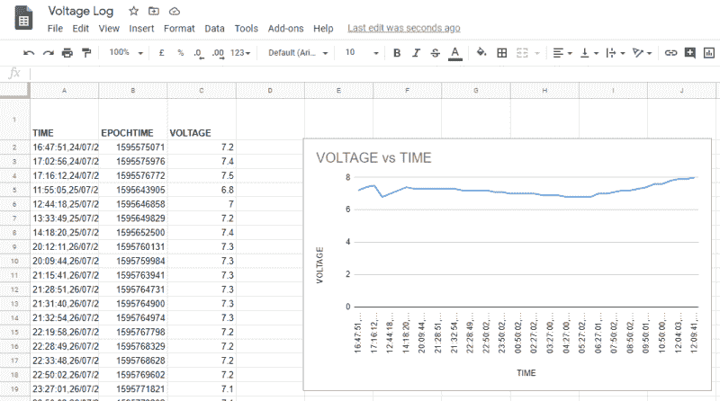

# 面向初学者的简单物联网日志选项

> 原文：<https://hackaday.com/2020/11/19/easy-iot-logging-options-for-the-beginner/>

*如果一个温度传感器在森林里进行测量，但周围没有人来读取它，它会热吗？*

如果你有一个收集数据的项目，你可能有理由把它放到网上。毕竟，能够从任何地方读取数据是有好处的，而且这也是构建更智能的互联系统的关键。另外，当你去酒吧的时候，你可以告诉陌生人你客厅的湿度，他们会对你印象深刻。

然而，进入物联网可能会令人生畏，因为有大量竞争服务和选择，从基础到工业级都有。今天，我们来看看初学者可以使用的两种在线记录数据的方法。

## 要寻找的关键点

当试图寻找一个在线日志平台时，有几件事需要考虑。易用性是首要考虑因素，因为那些刚刚接触物联网的人不需要被复杂性吓跑。任何涉及编译晦涩难懂的库或建立复杂数据库的东西都是不可能的。此外，成本也是一个因素。昂贵的订阅费让那些主要想涉猎的人望而却步。对于本文，我们选择了两个选项，它们具有良好的特性集，对初学者来说入门门槛较低。

## IOT 绘图仪

IOTPlottter will graph your data in an attractive way, all with a minimum of fuss.

对于许多物联网项目来说，目标是获得一堆传感器，监控输出，并制作一些图表。如果那是你的用例， [IOTPlotter](http://iotplotter.com/) 顾名思义，可能就是你的工具。免费使用，非常适合低调记录数值数据。

要使用 IOTPlotter，需要创建一个 *feed* ，它通常对应于单个设备。这个提要可以包含几个图形，涉及不同的传感器或数据。写入提要很容易，通过 Python 代码或任何其他能够发出基本 HTTP 请求的平台都可以轻松实现。为了防止随机入侵者进行未经授权的更改，提要由一个 API 密钥保护，提交数据和发出请求需要这个 API 密钥。虽然这绝不是一种高端的安全措施，但对于一般的 DIY 项目来说已经足够了。

其他一些特性让 IOTPlotter 变得更加有用。可以将多个数据馈送合并到一个图表中，还可以自动导出 PNG 格式的图表供外部使用。这尤其适用于您希望在外部网站或移动电话应用程序中显示数据的情况。还有隐私选项，允许你关闭你的饲料，以便它只为你的眼睛。也许在这个层次上你可能错过的唯一特性是数据导出——没有一种简单的方法可以将你迄今为止收集的所有数据生成一个 CSV 文件。

该服务的文档非常简洁——只有两页长！那些有基本 Python 经验的人可以在半小时内上线并登录，包括初始注册。如果你的应用转向更强大的应用，就要考虑费率限制，而且作为一项免费服务，它不会像全商业产品那样有保证。但是如果你在那个层次工作，很可能 IOTPlotter 并不适合你。

## 谷歌工作表

Google Sheets doesn’t automatically graph for you, so you’ll have to set that up yourself. However, your data is all there in a convenient format for number crunching later on.

如果您的日志记录需求更为重要，并且您已经打算在跟踪过程中进行一些严肃的数字处理，那么您将希望专注于以一种可访问的格式存储您的数据。把它扔进电子表格是一个很好的方法，Google Sheets 是一个很好的在线平台。当你只需要处理创建、读取、更新和删除记录时，我们称之为 CRUD 应用。虽然使用全脂数据库更为常见，但对于许多应用程序来说，Google Sheets 已经足够强大，而且设置起来要简单得多。另外，它已经设置为可以从任何地方访问，也可以很容易地与他人共享。

作为一个电子表格，你有充分的灵活性以任何你喜欢的方式输入数据。然而，这也意味着向 Google Sheets 中写入内容会稍微复杂一些。还需要通过 OAuth 2 和 Google API 控制台进行授权。这不像使用 IOTPlotter 那么容易，但对于普通用户来说，仍然可以在几个小时内实现。这些要求意味着使用计算机(如 Raspberry Pi)使用 Google Sheets 通常比使用微控制器更容易。[[Greg Baugues]为从事 Python 工作的人提供了一个很好的完成工作的指南。](https://www.twilio.com/blog/2017/02/an-easy-way-to-read-and-write-to-a-google-spreadsheet-in-python.html)然而，可以使用变通方法在更轻量级的平台上完成工作。正如[Shishir Dey]所展示的，借助一点脚本，可以通过 HTTP 请求[向 Google 提交表单。](https://medium.com/@shishir_dey/upload-data-to-google-sheet-with-an-esp32-and-some-scripting-2d8b0ccbc833)

这种方法的好处是导出数据以供进一步分析很简单。只需点击“文件->下载”即可提供包括 CSV 在内的多种导出选项。这使得数据可以在 MATLAB 或其他脚本语言等软件中使用，允许您运行统计数据并生成图表，直到奶牛回家。这需要一点额外的跑腿工作，但对于科学项目来说，这种灵活性是从数据中获得良好结果的关键。

## 其他选项

对于那些寻找更华丽的界面或更防弹产品的人来说，其他选择确实存在。[我们以前在物联网服务上运行过功能，](https://hackaday.com/2017/10/31/review-iot-data-logging-services-with-mqtt/)也讨论过[MQTT 作为数据传输方法的好处。](https://hackaday.com/2016/05/09/minimal-mqtt-building-a-broker/)如果我们今天在这里讨论的内容不太符合要求，请进一步阅读现有内容，看看哪种最适合您的使用情形。当你的项目完成后，拍些照片，[给我们写封短信](http://hackaday.com/submit-a-tip)，一如既往，祝你黑客生涯愉快！