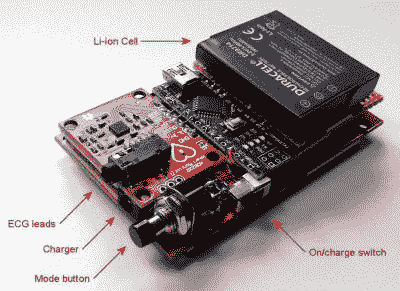

# 心电图项目与所有混乱的安全细节

> 原文：<https://hackaday.com/2021/05/03/ecg-project-with-all-the-messy-safety-details/>

我们已经在 Hackaday 上看到了许多心率监测项目，但[【Peter 的】心电图(ECG)仪真正引起了人们的注意](https://www.instructables.com/ECG-Display-With-Arduino/)。

如果您已经关注 Hackaday 一段时间，您可能已经对记录 ECG 所需的硬件有些熟悉了。首先，你需要一个高输入阻抗的仪表放大器，从小心放置在受试者身体上的电导线中获取毫伏信号。为了实现这一点，他使用了 AD8232 单导联 ECG 模块(我们实际上已经看到[该器件用于制作基于声卡的 ECG](https://hackaday.com/2019/04/25/sound-card-adcs-for-electrocardiograms/) )。该芯片内置一个仪表放大器和一个可选的次级放大器，用于额外的增益和低通滤波。ECG 信号受到电源噪声的干扰，可以通过简单的低通滤波器进行部分衰减。然后，[Peter]使用 Arduino Nano 对 AD8232 的输出进行采样，实施数字陷波滤波器以进一步降低电源噪声，并在 2.8 英寸 TFT 显示屏上显示输出。

除了电路本身，他的项目还有两件事真正引起了我们的注意。[Peter]向读者介绍了商用 ECG 设备的所有不同安全注意事项，并将这些原则应用到他的简单 DIY 设置中，以确保他自己的安全。正如[彼得]所说，专业医疗电子产品应该效仿 IEC 60601。这是一份相当庞大的文件，但从[Peter 的]文章中引用的主要原则是:

1.  限制有多少电流可以通过病人
2.  我能通过病人多少电流？
3.  需要什么样的电气隔离？
4.  如果一个“组件”出现故障，会发生什么？
5.  我能产生多大的电磁干扰？
6.  除颤器呢？

[Peter]提到他的电路本身并不完全符合标准(尽管他做了一些诚实的尝试)，但他为此制定了一个粗略的计划。这些措施包括使用高值输入电阻连接电极，并在电极输入端添加一些保护二极管，以便该设备能够承受除颤器。当然，有两个简单的策略你一定要遵循，一是使用电池供电，二是把设备放在一个有适当屏蔽的外壳中。

[Peter]还在分解心脏的电生理学方面做了大量工作，并将其与非医疗专业人员可能更熟悉的术语联系起来。如果我们将心脏与一个简单的电压源联系起来，比如电池，甚至是一个函数发生器，那么理解人类的心脏可能就不那么令人生畏了。你可以把我们细胞中的离子想象成产生势能的电荷载体，把神经纤维想象成电脉冲穿过身体的电线。

老实说，[Peter]在他的项目中提供了丰富的信息和工具，这些信息和工具一定会对您的下一个构建有所帮助。您可能还会发现他的 ECG 模拟器代码非常方便，他的低内存显示驱动程序代码也很有帮助。很酷的项目，[彼得]！

测量心电图是我最关心的事情(抱歉，忍不住)。在我成为一名作家之前，我自己的两个项目曾在 Hackaday 上亮相，包括采用 Arduino shield 外形的生物医学传感器套件和围绕仪表放大器 ad 623 构建的简单的 T2 ECG。