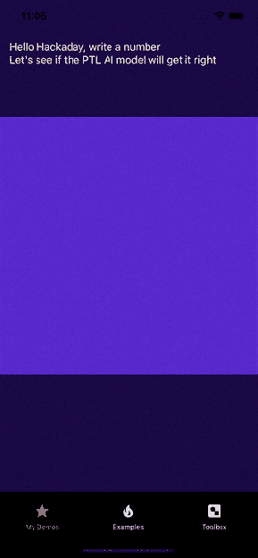
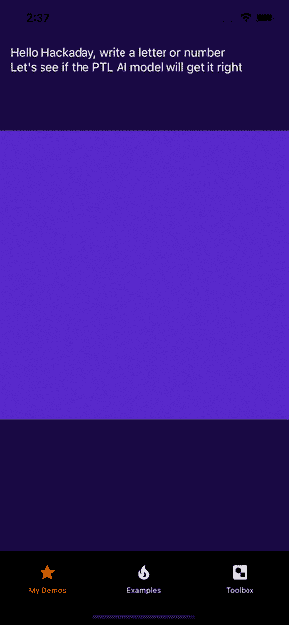

# 在边缘中学习，在边缘中前进

> 原文：<https://hackaday.com/2022/06/21/edging-ahead-when-learning-on-the-edge/>

“有了 edge AI 的**力量**在手，你的事业将*不可阻挡。*

这就是人工智能公司的市场营销。每个人似乎都在边缘拥有云规模的人工智能支持的商业智能分析。虽然听起来令人印象深刻，但我们并不相信营销废话意味着什么。但如今边缘设备上的人工智能是什么样子的呢？

处于边缘状态仅仅意味着实际的人工智能评估甚至微调在用户的设备上本地运行，而不是在一些云环境中。这对企业和用户来说都是双赢。由于传输回中央位置的信息较少，因此更容易保护隐私。此外，人工智能可以在某个地方的服务器可能无法访问或提供足够快的响应的情况下工作。

谷歌和苹果都有自己的 AI 库，分别是 ML Kit 和 Core ML。有一些工具可以将 Tensorflow、PyTorch、XGBoost 和 LibSVM 模型转换成 CoreML 和 ML Kit 可以理解的格式。但是其他解决方案试图为训练和评估提供一个平台无关的层。[我们之前也报道过 Tensorflow Lite (TFL)](https://hackaday.com/2017/11/23/smarter-phones-in-your-hacks-with-tensorflow-lite/) ，这是 Tensorflow 的精简版，自 2017 年以来已经相当成熟。

在这篇文章中，我们将关注 [PyTorch Live (PTL)](https://pytorch.org/live/) ，这是一个用于将 PyTorch 模型添加到智能手机的精简框架。与 TFL(可以在 RPi 和浏览器中运行)不同，PTL 完全专注于 Android 和 iOS，并提供紧密集成。它使用 react-native 支持的环境，这意味着它非常适合于 [node.js world](https://hackaday.com/tag/nodejs/) 。

## 不需要云

现在，PTL 还很早。它可以在 macOS 上运行(尽管没有苹果芯片的支持)，但 Windows 和 Linux 的兼容性显然即将到来。它附带了一个方便的 CLI，使得开始一个新项目相对容易。在安装和创建一个新项目后，体验很流畅，几个命令就搞定了一切。教程很简单，很快我们就有了一个可以识别数字的演示。

 是时候进一步学习教程并创建自定义模型了。使用 [EMNIST 数据集](https://arxiv.org/pdf/1702.05373v1.pdf)，我们使用[一个有用的 GitHub repo](https://github.com/sejalgupta01/EMNIST-Classification) 的帮助，用字母数据集创建了一个经过训练的 [resnet9 模型](https://en.wikipedia.org/wiki/Residual_neural_network)。一旦我们有了一个模型，使用 PyTorch 工具将模型导出到 lite 环境就足够简单了。通过对代码(在模拟器上实时重新加载)的一些调整，它可以识别字符而不是数字。

我们怀疑在机器学习领域更有经验的人能够比我们走得更远。PTL 还有其他令人兴奋的演示，如[设备上的语音识别](https://github.com/pytorch/ios-demo-app/tree/master/SpeechRecognition)和[现场视频分割](https://github.com/pytorch/ios-demo-app/tree/master/TorchVideo)和识别。总的来说，体验很简单，我们尝试的场景也相对容易实现。

如果你已经在一个智能手机反应原生世界，PTL 似乎很容易集成和使用。除此之外，很多都没有得到支持。当我们第一次介绍 Tensorflow Lite 时，它也受到了类似的限制，后来它变得成熟并获得了新的平台和功能，成为一个拥有许多受支持平台的强大库。最终，我们将看到 PyTorch Live 成长为什么。beta 分支中已经有对 GPU 和神经引擎的支持。