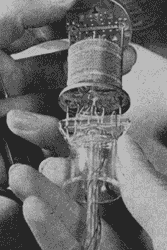
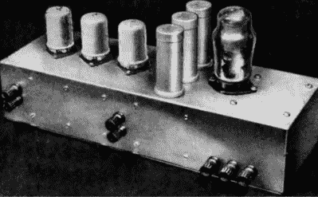
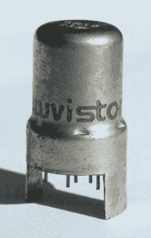

# EF50:改变一切的管子

> 原文：<https://hackaday.com/2019/02/12/ef50-the-tube-that-changed-everything/>

从今天的角度来看，真空管是相当低的技术。但有一段时间，它们是高科技的巅峰，早期真空管在传输和计算方面展现出的前景让大量研究接踵而至。事实上，随着时间的推移，管道变得非常复杂和难以制造。毕竟，它们像今天的集成电路一样无处不在，所以它们得到大量的研发也就不足为奇了。

例如，在 1938 年之前，电子管就像灯泡一样制造。随着对它们的要求越来越高，传统的灯泡设计已经不够了。首先，引线的寄生电感和电容会限制电子管在高频应用中的使用。甚至电子从电子管的一部分到达另一部分所需的时间也是一个瓶颈。

有几次尝试加快电子管的速度，包括 RCA 的 acorn 电子管、 [lighthouse 电子管](https://www.youtube.com/watch?v=S1lFS_N0kaY)和 Telefunken 的 Stahlrö hre 设计。这些通常试图保持导线短，管小。飞利浦公司在 1934 年就开始着手解决这个问题，因为他们预见到对工作频率更高的电视接收机的需求。

Hans Jonker 博士是提议解决方案的主要开发者，并在内部技术说明中发表了他的设计，描述了一种比其他解决方案更容易制造的全玻璃管。现在他们所需要的是一个实际的应用程序。虽然他们最初认为杀手级应用将是电视，但 E50 最终将帮助盟军赢得战争。

## 电视机

在英国，亚历山德拉宫只有一台电视发射机——这就是后来的英国广播公司的前身。这不仅是第一个公共电视服务，也是第一个完全电子化的电视系统。最终被飞利浦收购的 Pye 有限公司生产的接收器取得了惊人的成功。声音频率为 41.5 兆赫，视觉频率为 45 兆赫——这在当时是很高的频率了。

在需求的刺激下，Pye 认为射程更远的电视机将为接收器创造更广阔的市场。问题是在他们的调谐射频(TRF)设计中找到一个可以处理 45 MHz 频率的电子管。

Pye 写下了他们所需的规格，但无法可靠而廉价地制造它们。他们转向飞利浦，后者采纳了 Jonker 的想法，并添加了一些应用所需的物品，生产出了 EF50——一种五极管。[制成的电视机](https://www.americanradiohistory.com/Archive-Wireless-World/30s/Wireless-World-1939-08.pdf)(见第 199 页)的范围大约是旧电视机的五倍。

## 建筑

旧的电子管使用一种叫做收缩的困难工艺来密封玻璃管的末端，导线穿过玻璃管。该收缩形成倒 V 形，其中该管的胶木基底与该 V 形的宽部分相配合，并且其中的电线通过该 V 形的尖端进入该管。

 这有几个问题。随着更多的电线必须穿过这个收缩区，它们必须靠得更近。增加了杂散电容。更糟糕的是，从 V 形底部到 V 形顶部的距离意味着电线必须相对较长，这增加了电感。最后，V 字形的尺寸——通常是管子总长度的一半——阻碍了管子变小，阻碍了便携式设备的发展。

解决这个问题的一个方法是用金属而不是玻璃来建造管道，一些连接穿过管道的顶部。然而，大量制造这些管是昂贵的，并且设计者不喜欢必须在管的顶部布线。Stahlrö hre 逆潮流而动，将管组件水平放置，以减少与底座的连线，并且不使用顶部连接。然而，制造成本还是很高。1934 年的 acorn 电子管是全玻璃的，用短导线将两部分密封在一起，但众所周知，生产成本很高。

## 飞利浦，派伊和战争

当荷兰军方在 1918 年左右第一次向飞利浦公司索要电子管时，他们拒绝了；杰拉德·菲利普斯认为无线电没有什么实用价值。直到 1923 年，飞利浦才决定利用其在灯泡方面的专业知识来生产电子管。到 1938 年，Jonker 的工作已经广为流传，1939 年甚至有一篇关于它的文章发表在《无线工程》杂志上。

当 Pye 开始寻找高频电子管时，由于之前的工作，飞利浦已经做好了准备。Pye 接收器使用了六根管子，需要一些调整，包括增加一个金属屏蔽。

与此同时，战争爆发了。不列颠之战发生在 1940 年，而军方在 1939 年忙于研究同样在高频下工作的雷达。这种雷达——以及与之配合使用的指挥和控制策略——将是赢得即将到来的战斗的关键。研究机载雷达的团队显然只有一个足够好的接收器来获得结果。然后，他们收到一个提示，Pye 有一个很好的接收器，可以在相同的频率范围内工作。这成为战争期间英国雷达设置的基础。大约 60%的 Pye 电视中频信号出现在英国的雷达设备中。

最大的问题是，到 1940 年，荷兰已经落入德国人手中。生产线需要转移到英国，当英国皇家海军温莎号(HMS Windsor)将逃脱的荷兰政府带到英国时，飞利浦家族也携带着生产 EF50 电子管中使用的细钨丝所需的钻石模具。

战后，EF50 在许多示波器和无线电接收机中找到了自己的位置。这既是因为其优越的频率能力和战争盈余的可用性。其他公司也生产电子管，包括马可尼-欧司朗(Z90)和科索尔(63SPT)。Mullard 使用最初的 Phillips 设备生产电子管，Rogers 和 Sylvania 也生产了一个版本。

## 新访客

 这种类型的电子管在 1959 年之前一直是射频工作的王者。那一年，RCA 推出了 nuvistor——一种在真空室中组装的金属和陶瓷管。这些器件几乎和晶体管一样小，噪音低，在无线电频率下具有出色的性能。直到 20 世纪 70 年代早期，在许多设备中都发现了这些，包括电视调谐器、示波器和录音机。

## 更多细节

如果你想真正挖掘细节，与 EF50 相关的每个人和每件事都有一段很长的、经过充分研究的历史。甚至还有[关于它的部分原始内部报告的翻译](http://www.dos4ever.com/EF50/Jonker_samenvatting.html)。你也可以在【凯斯投掷者】网站找到[类似的信息和大量独特的图片](http://www.r-type.org/articles/art-021.htm)。

如果你喜欢旧电子管收音机的声音，下面视频中的中波接收器使用一些 EF50s，听起来很棒。想要更多[管历史](https://hackaday.com/2018/06/22/the-history-and-physics-of-triode-vacuum-tubes/)？或者也许你更愿意[自己做](https://hackaday.com/2016/05/04/home-brew-vacuum-tubes-are-easier-than-you-think/)。或者你可以看看他们[当年是如何制造类似的电子管](https://hackaday.com/2014/08/05/retrotechtacular-we-heard-you-like-tubes-so-heres-a-film-about-tube-tubes-from-the-webtubes/)的。

 [https://www.youtube.com/embed/i5kPAUB98Mk?version=3&rel=1&showsearch=0&showinfo=1&iv_load_policy=1&fs=1&hl=en-US&autohide=2&wmode=transparent](https://www.youtube.com/embed/i5kPAUB98Mk?version=3&rel=1&showsearch=0&showinfo=1&iv_load_policy=1&fs=1&hl=en-US&autohide=2&wmode=transparent)

