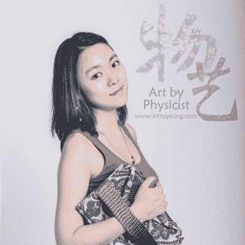
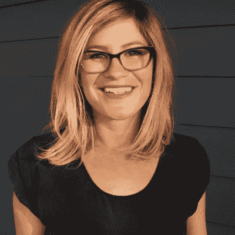
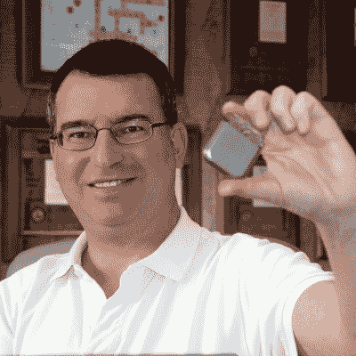
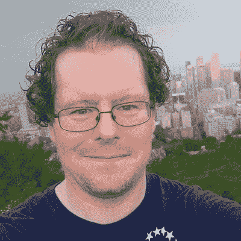
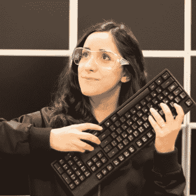
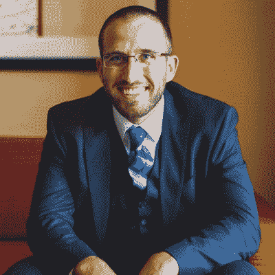
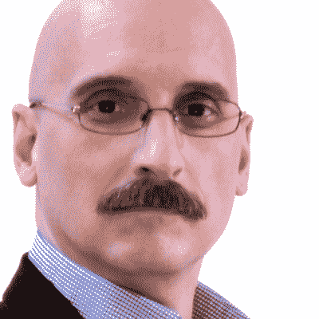

# 你将在 Supercon 看到另外八位演讲者

> 原文：<https://hackaday.com/2018/10/02/eight-more-speakers-youll-see-at-supercon/>

在[黑客日超级大会](https://www.eventbrite.com/e/hackaday-superconference-2018-tickets-47386813234?aff=talksPost1)上提升你的硬件水平。我们很高兴与大家分享几周后即将来到帕萨迪纳的优秀演讲者。向下滚动八个不可思议的演讲，它们将告知、启发和激发你内心的工程灵感。

这是最终的硬件会议，你需要在那里！随着最终确认的到来，我们将继续宣布演讲者和研讨会。Supercon 将售罄，所以现在就[抢票吧](https://www.eventbrite.com/e/hackaday-superconference-2018-tickets-47386813234?aff=talksPost1)以免为时过晚。

Kitty Yeung
Tech-Fashion Designs and the Wearables Industry

在创新设计的推动下，可穿戴设备行业拥有巨大的机遇，但也面临着规模和科学研究方面的重大挑战。构建可编程服装和未来会带来什么。

Erika Earl
How to Stay Grounded When You Have Zero Potential

为什么“接地”对于开发电子硬件至关重要，以及如何在设计中实现接地方案。

David Prutchi
DIY Ultraviolet Photography

改装相机，制造镜头，选择滤镜，像蜜蜂一样看东西。探索紫外光谱的艺术和技术头脑。

Brad Luyster
Communication, Architecture, and Building Complex Systems for SPAAACE

建造第一台在国际空间站上飞行的双转子模块化离心机。独创性和站在巨人的肩膀上建造复杂的系统。

Estefannie
Daft Punk Is Playing In My Helmet

在家庭工作室制作惊人复制品的工具和技术的旋风式旅行；电子学、真空成型、3D 打印和如此之多的打磨赋予了忠实的蠢朋克头盔复制品以生命。

Scott Swaaley
Lessons Learned in Designing High Power Line Voltage Circuits

实用技巧设计高功率线电压电路，使交流设计和修补安全，有效，就像 DC 便宜。

Alex Hornstein
Hacking the Lightfield

用普通相机拍摄全息照片和视频。自定义照片钻机和疯狂的问题，使光场视频钻机。

Ted Yapo
Dealing with a Cheap Spectrum Analyzer

一个令人惊讶的简单电路，一些有趣的数学知识，以及《黑客日报》创刊号上的一篇你所不知道的文章。

## 我们希望你在超级公司！

Hackaday 超级大会是任何地方的硬件黑客都不能错过的活动。加入为期三天的精彩讲座和研讨会，关注硬件创新。这是你的硬件黑客社区，他们聚集在一起攻击官方的硬件徽章和其他一些有趣的项目。[马上拿到票](https://www.eventbrite.com/e/hackaday-superconference-2018-tickets-47386813234?aff=talksPost1)！