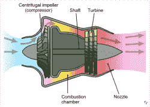

# 电动喷气式发动机使用 3D 打印的压缩机，完全跳过涡轮。

> 原文：<https://hackaday.com/2022/03/02/electric-jet-engine-uses-3d-printed-compressor-skips-the-turbine-altogether/>

涡轮喷气发动机是 20 世纪工程的一个不可思议的部分，除了一些边缘情况，大部分已经被涡轮风扇发动机取代。尽管如此，即使是最基本的早期设计在当时也是开创性的。材料科学的应用使它们更可靠、更强大、更轻便。但当你是[Integza]的[Joel]时，所有这些令人难以置信的进步都完全消失了，你更喜欢使用重新利用的丁烷罐和 3d 打印零件来制造你的内燃机，正如你在休息时间下方的[视频中看到的那样。](https://www.youtube.com/watch?v=bha6yZsS7oY)

Emoscopes, [CC BY-SA 3.0](http://creativecommons.org/licenses/by-sa/3.0/) via Wikimedia Commons

为了理解[Integza]的发动机，快速解释一下涡轮喷气发动机是有帮助的。就像其他内燃机一样，空气被压缩，燃料燃烧，反应产生功。在涡轮喷气发动机中，压缩机压缩空气。燃料在燃烧室中添加并点燃，膨胀的废气驱动涡轮，涡轮反过来驱动压缩机，因为两者都连接到同一根轴上。能量没有用于转动涡轮的废气被排出并产生推力，以相反的方向推动发动机和它所连接的车辆。简单吧？对！直到 3d 打印机问世。

可悲的是，3d 打印零件是由塑料制成的。据我们所知，塑料不是金属，所以 3d 打印涡轮机让极热的废气转向是行不通的。但是，如果你只是跳过了整个涡轮部分，用一个电动马达驱动压缩机呢？你没有使用带有大量微小叶片的轴流式压缩机，这些叶片很可能无法以足够的强度进行 3d 打印，而是使用了坚固、易于打印的离心式压缩机？当然，这正是[Integza]所做的，否则我们不会谈论它。结果太棒了，尤其是考虑到整个机器是用 3d 打印和自制点焊机制造的。

如果你想建造一个完整的喷气涡轮机，我们不会说这很容易，但你可能会欣赏这个[喷气涡轮机，它的组件包括一个卫生纸架](https://hackaday.com/2013/10/05/please-dont-build-a-jet-engine-from-a-toilet-paper-holder/)作为一项技术一旦被理解的证明，它可以以最糟糕的方式建造，但仍然工作。算是吧。

 [https://www.youtube.com/embed/bha6yZsS7oY?version=3&rel=1&showsearch=0&showinfo=1&iv_load_policy=1&fs=1&hl=en-US&autohide=2&wmode=transparent](https://www.youtube.com/embed/bha6yZsS7oY?version=3&rel=1&showsearch=0&showinfo=1&iv_load_policy=1&fs=1&hl=en-US&autohide=2&wmode=transparent)

