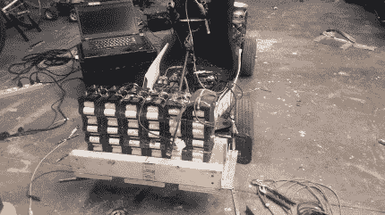
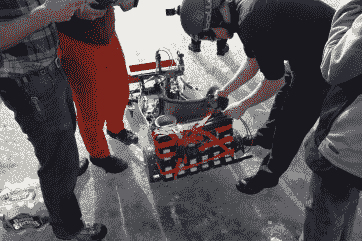

# 冰上电动汽车

> 原文：<https://hackaday.com/2019/08/16/electric-vehicles-on-ice/>

今年冬天，一群电动汽车爱好者，包括[Dane Kouttron]，在附近半冰冻的苔原上驾驶他们自制的电动卡丁车比赛，作为他们每年冬季传统的一部分。这些交通工具被恰当地命名为“原子之物”和“末日雪橇”( T1 ),它们需要完美的天气条件来真正经受考验。你想要一个像玻璃一样的赛道，但是冰上的降雪冻结成一个冰糊状的中间物，最终对于高速冰车来说太粘了。诀窍是观察温度保持在零度以下，没有像雪一样的降水。

这个组织来自麻省理工学院的社区创客空间，被称为 [MITERS](http://miters.mit.edu) ，已经有了 EV 黑客经验。他们改装了他们的大众 Things 汽车(最初是为高速电动汽车比赛建造的)，以从设计中挤出更多的速度。从 8 速禧玛诺变速箱和 7 千瓦电机开始，他们用从普锐斯 A123 Hymotion 项目中回收的圆柱形 A123 电池组装了一个巨大的 24S 10P 电池。这个庞然大物在 84V 下运行，容量为 22AH，足够团队充分利用电机的潜力。

电池被棘轮绑在原子物体的背面，以提供更多的冰上牵引力。感觉一定就像坐在一种不同的火箭上。

  Original configuration of battery packs  Battery packs ratchet strapped

他们试着在原子的前面使用冰刀，但是在粗糙的冰上很难控制方向。实心防滑轮胎表现非常好，减少了驾驶者的震动。厄运雪橇是一种由焊接钢管框架和带有用于转向的冰刀的登山车组成的奇妙装置。马达——一个莫特尼吉·DC 电刷[me 909]——是从实验室清理中抢救出来的，通过链条和键轴将动力传递给轮子。轴到车轮的扭矩通过两个带键的轮毂适配器及时传递。

Doom Sled with seat strapped on

船员们用一个长筒望远镜安装了一个座位，并用铝制 u 形槽制作了一个链条防护装置，以防止飞行链条远离驾驶员的手指。最终的用户界面包括一个右侧的油门和一个左侧的“电动刹车”(使用电阻快速移除储存的能量，以对抗车辆产生的巨大惯性)。

总的来说，冰上赛跑是成功的！你可以看到比赛条件非常完美，湖面上的冰很少。任何粗糙的补丁在一天结束时肯定会被缓冲平滑。

[https://player.vimeo.com/video/253568520](https://player.vimeo.com/video/253568520)