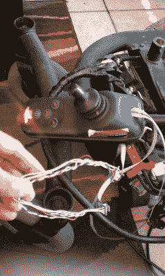

# 电动轮椅为大型机器人提供了一个很好的基础

> 原文：<https://hackaday.com/2019/06/20/electric-wheelchair-makes-a-great-base-for-a-big-robot/>

Wiring into the joystick is a quick and easy way to hack in custom control to a wheelchair.

制造机器人可能很有趣，并且仍然是许多黑客和制造者的流行消遣。然而，硬件方面的事情可能会令人生畏。对于那些试图建造更大规模的东西的人来说尤其如此。一个很好的捷径是从一开始就使用一个强大的机械平台—[,使用电动轮椅是一个很好的方法。](http://musingsandhobbies.blogspot.com/2009/11/robot-building.html)

[Nikita]早在 2009 年就开始了这个项目，当时他在一个跳蚤市场发现了一个坏掉的电动轮椅。它不再适合用作轮椅，所以[尼基塔]能够以仅 50 美元的低价获得它。对于一个包括坚固的底盘、车轮、电机和驱动这一切所需的控制器的包来说，这是一个很大的价格。有了平台，是时候进行黑客攻击了。

到目前为止，[尼基塔]甚至把轮椅上所有无关的零件都拆了，让它成为一辆机动化的马车。在 Arduino 的帮助下实现了无线电控制，并添加了一对“眼睛”来赋予它一点个性。它也仍然可以用原来的操纵杆来驱动，操纵杆已经重新定位在底盘上。未来的计划包括增加一定程度的自主性，以允许“机器人”导航路标和识别人脸，这两项任务在 2019 年的技术下应该会容易得多。我们急切地想知道它接下来会走向何方；[毕竟，我们以前见过轮椅硬件的巨大应用](https://hackaday.com/2018/07/09/on-the-right-tracks-electric-wheelchair-guts-find-new-life-as-tank/)。休息后的视频。

 [https://www.youtube.com/embed/WGaO2vcBx4s?version=3&rel=1&showsearch=0&showinfo=1&iv_load_policy=1&fs=1&hl=en-US&autohide=2&wmode=transparent](https://www.youtube.com/embed/WGaO2vcBx4s?version=3&rel=1&showsearch=0&showinfo=1&iv_load_policy=1&fs=1&hl=en-US&autohide=2&wmode=transparent)

