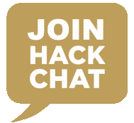
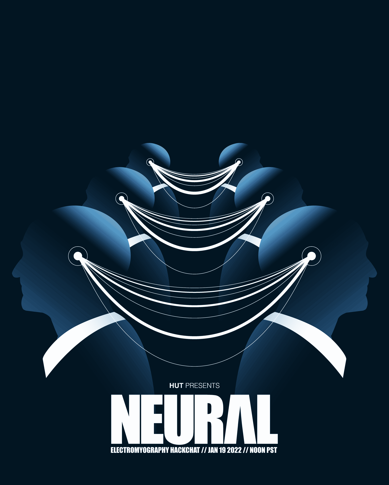

# 肌电图黑客聊天

> 原文：<https://hackaday.com/2022/01/17/electromyography-hack-chat/>

加入我们太平洋时间 1 月 19 日星期三中午的节目，我们将与[小屋](https://hackaday.io/hacker/1209371-hut)的[肌电图黑客聊天](https://hackaday.io/event/183577-electromyography-hack-chat)一起开启 2022 黑客聊天季！

这是大多数人能做的最简单的动作之一，但是仅仅摆动你的手指是一个非常复杂的过程。一旦你有意识地决定移动你的手指，一连串的电化学反应就会从大脑沿着脊髓和神经到达前臂的肌肉纤维，在那里还会发生更多的反应来刺激肌肉纤维并使它们收缩，从而使手指摆动。

 当你移动肌肉时，你体内的电活动实际上足够强，可以到达皮肤，并且可以用肌电图检测出来。但是仅仅因为一个信号的存在并不意味着利用它是微不足道的。即使对家庭游戏玩家来说，在人体内其他一切事物的噪音中梳理一个肌肉群的可用信号可能是一件苦差事，但不是不可克服的。

为了让 EMG 变得简单一点，我们这次黑客聊天的主持人 hut 一直在努力开发 [PsyLink](https://psylink.me/) ，这是一系列原型 EMG 接口，可以用来检测肌肉运动，并用它们来控制你想要的任何东西。在这次聊天中，我们将深入研究 EMG，特别是 PsyLink，并了解如何让我们的肌肉做一些除了摆动手指之外的事情。

我们的黑客聊天是在 [Hackaday.io 黑客聊天群发消息](https://hackaday.io/messages/room/2369)中的实时社区活动。本周，我们将于太平洋时间 1 月 19 日星期三中午 12:00 坐下来讨论。如果你被时区束缚住了，我们有一个[方便的时区转换器](https://www.timeanddate.com/countdown/generic?iso=20220119T12&p0=224&msg=Electromyography+Hack+Chat&font=cursive)。

