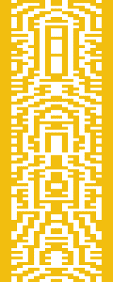

# 研究人员剖析巧妙的迷宫生成算法，部分埋藏的秘密被发掘出来

> 原文：<https://hackaday.com/2019/09/30/emtombed-secrets-partially-unearthed-as-researchers-dissect-clever-maze-generating-algorithm/>

如果你看够了另一个开发者的代码，你最终会说，“你到底在想什么，你这个该死的疯子？”现在，这种交流可以发生在你离开一家公司住进一间软垫房之前，也可以类似于称某人为疯狂的天才并给他们一杯啤酒。在[史蒂文·西德利]1982 年的游戏*被埋葬*的案例中，[约翰·艾科克]和[塔拉·科普斯通][发现了一个用于生成伪随机迷宫的神秘表格，并写了一份关于它如何工作的白皮书](https://arxiv.org/ftp/arxiv/papers/1811/1811.02035.pdf)。该表只产生可解决的迷宫，但如果任何位被改变，拼图变得不可避免。

软件考古学家目前处于他们自己的迷宫中，出口是对桌子的解释，但路径上长满了十年的藤蔓。程序员没有自己制作这个表，它的创建者的名字被埋在迷宫的某个地方。游戏车的存储空间极其有限，所以迷宫*需要*即时生成，而不是精心制作和存储。*entembed*的特别方法通过评估前一行并基于特定标准生成下一行来工作，并在某些地方使用一些 PRNG 来保持其新鲜。为了节省更多的空间，屏幕被镜像到中央，这使得桌子的工作量增加了一倍。有一天，这张神秘的桌子的起源可能会被解释，但现在，它本身就是一件艺术品。

除了一张直接从以太中抽出的桌子，这款[迷宫游戏](https://hackaday.com/2018/12/15/maze-generator-keeps-plotter-and-kids-busy/)依赖于伪随机数，但在这方面还有[改进的空间](https://hackaday.com/2018/01/08/entropy-and-the-arduino/)。

Via [BBC 未来](http://www.bbc.com/future/story/20190919-the-maze-puzzle-hidden-within-an-early-video-game?utm_source=pocket-newtab)。