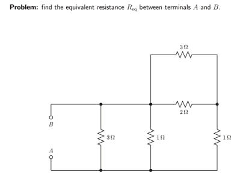
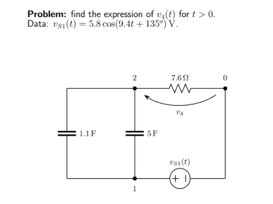

# 无尽的电子问题需要解决

> 原文：<https://hackaday.com/2019/10/15/endless-electronic-problems-for-solving/>

我们知道，不是每个喜欢构建电路的人都想一头扎进让一切正常工作的底层电气工程。然而，如果你想，现在是一个伟大的时间。许多大学的大部分或全部资料都在网上，你甚至可以免费选修许多课程。如果你想要一个无止境的已解决的学习问题库，请查看[自动电路](https://autocircuits.org)。它可以产生许多不同种类的电子问题及其解决方案。

你可以得到一个完全随机的电路，或者选择关注 DC、交流、双端口或其他类型的问题。你也可以改变问题的一般形式。例如，对于 DC 分析，您可以让它指定电路值，以便答案是一个值，如 45 欧姆，或者您可以让它只使用符号，以便答案可能是 i [4] =V [1] /4R。你甚至可以选择难度级别和避免某些类型的问题。动作要快。网站出现问题后，在它永远消失之前，你有 10 秒钟的时间下载它。

问题的范围从简单到复杂，例如，我们的第一个截图是一个简单的。

该程序提供了解决方案，但这个非常简单，只需将并联电阻和串联电阻结合起来。对于符号电阻，值可能是 R、3R 和 9R。或者你可以选择 0.23R 这样的非整数或者 22/5 这样的有理数作为乘数。

这个程序还有一个很酷的特性:你可以输入一个 SPICE 网表来插入你自己的电路。有一些限制。例如，您只能有 10 个节点，并且有一些严格的命名约定。此外，将随机选择所有组件值。

对于 SPICE 函数的示例，请尝试以下网表:

v _ 1 1 0 AC
C _ 1 1 2
C _ 2 1 2
R _ 1 2 0
。TRAN 求解 V(2，0)

输出看起来像右边的屏幕截图，尽管您的几乎肯定会有不同的随机值:

如果你和我们一样，懒得算出来，输出也显示了答案:*v*[4](t)=(-4.111 cos(9.4*t*)-4.092 sin(9.4*t*)。是啊。我们也是这么想的。

如果你也在教电子学，那就太好了。你可能会产生无穷无尽的家庭作业或测验问题。[Stephano]免费提供这项服务，并使用 MATLAB、BLAG 和 LaTeX 等软件施展魔法。

如果您想重温 Spice 并使用它进行分析，我们已经[介绍过](https://hackaday.com/2016/02/29/spice-power/)。顺便说一下，你通常学习的第一个分析工具是[节点分析](https://hackaday.com/2017/05/25/ohm-dont-forget-kirchhoff/)，这将是解决这类问题的良好开端。