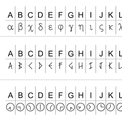

# 雕刻一个拼图盒？这里是单行 Cryptex 字体的集合

> 原文：<https://hackaday.com/2022/09/11/engraving-a-puzzle-box-heres-a-collection-of-single-line-cryptex-fonts/>

这里有一个来自[MSRaynsford]的简洁资源，值得任何对激光雕刻机、CNC 路由器或绘图机器人有创意的人收藏: [SVGFonts](https://github.com/msraynsford/SVGFonts) 是[MSRaynsford]为他的激光切割和雕刻 cryptex 字谜盒创建的单行符号字体。它们提供了一种将文本雕刻成符号的简单方法。

Single-line fonts for engraving that include a runic-looking alphabet, a Greek-inspired set, and two symbol sets based on Flag Semaphore.

字母和符号的 CNC 雕刻是那些看似简单，但实际上比看起来更复杂的事情之一。通常希望使用工具来用单线雕刻符号，就像人们用钢笔书写符号一样。但是字母和数字的字体和艺术通常不是一条线。谢天谢地，有一个 Hershey 文本形式的解决方案，它的扩展[包含在 Inkscape](https://wiki.inkscape.org/wiki/index.php/Release_notes/1.0#Hershey_Text) 中。原来[好时字体可以追溯到 20 世纪 60 年代](https://hackaday.com/2021/03/30/hershey-fonts-not-chocolate-the-origin-of-vector-lettering/)，当时电子和工业的变化带来了新的机遇，需要新的解决方案。

这就是为什么当[MSRaynsford]需要不同风格的字体和符号来创建他的难题箱时，他必须自己设计它们，它们必须是单线矢量艺术，就像好时的文本一样。这个小收藏包括设计成类似于北欧古字字母表的英文字母，一个受希腊启发的系列，以及两个基于[旗语](https://en.wikipedia.org/wiki/Flag_semaphore)的编码字母。

在 [GitHub](https://github.com/msraynsford/SVGFonts) 上抓取它们，因为你永远不知道什么时候你会需要[制作一个快速密码筒](https://hackaday.com/2015/03/08/combination-lock-made-out-of-paper/)。