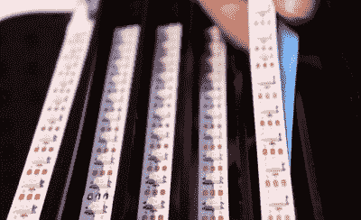

# 使用此定制 PC 侧面板输入矩阵

> 原文：<https://hackaday.com/2021/12/28/enter-the-matrix-with-this-custom-pc-side-panel/>

随着一部新的 *Matrix* 电影的上映，我们开始看到越来越多的项目围绕着该系列标志性的“数字雨”效果，这并不奇怪。一些特别独特的例子已经浮上了绿色寿司食谱虚拟海啸的顶端，[，比如这个由【威尔·唐纳森】](https://hackaday.io/project/183098-matrix-computer-side-panel)建造的非常光滑的 RGB LED PC 侧面板。

 【威尔】在他的电脑机箱里安装了一个黑色丙烯酸板，上面用激光切割出了所有的“代码”字符，取代了普通的透明窗口。在那后面是一排 WS2812B LED 灯条，嵌入垂直排列的通道中，防止光线水平射出。一片磨砂塑料夹在两者之间，这有助于漫射光，因此单个 led 不太明显。

所有的 led 都通过 74AHCT125 电平转换器连接到 NodeMCU ESP8266，尽管[Will]指出，您当然可以使用不同的微控制器，只需对代码进行一些调整。目前，用户使用安装在面板旁边的两个电位计和一个按钮从各种照明模式中进行选择。但是如果你愿意的话，肯定不需要太多的固件修改就可以从电脑上触发灯光效果。

坚持不懈的人会注意到，这意味着字符实际上不能改变或移动，但正如你在下面的视频中看到的，当 led 在他们身后移动时，它看起来仍然令人印象深刻。如果你想在一个相当小的规模上重现这个外观，看看这个 [Arduino 库，它只需要几行代码](https://hackaday.com/2021/11/17/arduino-library-makes-digital-rain-like-its-1999/)就可以让它在 TFT 显示屏上下雨。

 [https://www.youtube.com/embed/eAU8f_gP4ts?version=3&rel=1&showsearch=0&showinfo=1&iv_load_policy=1&fs=1&hl=en-US&autohide=2&wmode=transparent](https://www.youtube.com/embed/eAU8f_gP4ts?version=3&rel=1&showsearch=0&showinfo=1&iv_load_policy=1&fs=1&hl=en-US&autohide=2&wmode=transparent)

