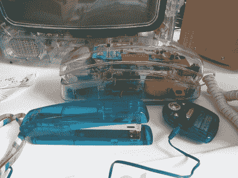

# Hackaday 播客 169:花瓶模式的 3D 打印，通过 Mega DIY 测量纳伏，最柔软的裤子是软件裤子

> 原文：<https://hackaday.com/2022/05/20/ep-169-3d-print-vase-mode-engage-measuring-nanovolts-through-mega-diy-and-the-softest-pants-are-software-pants/>

加入 Hackaday 主编埃利奥特·威廉姆斯和作业编辑克里斯蒂娜·帕诺斯的行列，我们来看看过去一周的顶级黑客。埃利奥特这次带来了一些相当书呆子气的东西，当我们讨论 iPod Touch 的消亡时，克里斯蒂娜渴望物理媒体，这是最后一个倒下的水果味 mp3 播放器士兵。

但是首先，我们来谈谈为什么我没有想到 3D 打印技术会利用花瓶模式来制作结构性的东西。我们将看看由笔记本电脑部件制成的透明电脑平台内部，惊叹于通过一丝不苟的电表设计可以获得的微小电压，并谈论老式旋转电话。

我们还花了一些时间讨论昂贵的时间卡时钟零件的廉价修复，并摇滚到可以使用各种东西作为共振腔的吉他。最后，Elliot 质疑软件和固件在隐藏你的肮脏秘密方面的区别，Kristina 则畅谈了使用你能负担得起的任何格式的透明电子设备和音乐欣赏。

如果你想继续，请点击下面的链接，一如既往，在下面的评论中告诉我们你对这一集的看法！

[//html5-player.libsyn.com/embed/episode/id/23178134/height/90/theme/custom/thumbnail/yes/direction/backward/render-playlist/no/custom-color/000000/](//html5-player.libsyn.com/embed/episode/id/23178134/height/90/theme/custom/thumbnail/yes/direction/backward/render-playlist/no/custom-color/000000/)

[直接下载链接](https://traffic.libsyn.com/secure/hackaday/Hackaday_Podcast-Ep169.mp3)

Where to Follow Hackaday Podcast

### 关注 Hackaday 播客的地方:

*   [谷歌播客](https://podcasts.google.com/feed/aHR0cDovL2ZlZWRzLnNvdW5kY2xvdWQuY29tL3VzZXJzL3NvdW5kY2xvdWQ6dXNlcnM6OTM5MTM0NzIvc291bmRzLnJzcw)
*   [iTunes](https://itunes.apple.com/us/podcast/hackaday-podcast/id1447409683)
*   [Spotify](https://open.spotify.com/show/3NRV0mhZa8xeRT0EyLPaIp)
*   [装订机](https://www.stitcher.com/podcast/hackaday-podcast)
*   [RSS](http://hackaday.libsyn.com/rss)

## 第 169 集节目预告:

#### 本周新闻:

#### 那是什么声音？

上周的声音是一个 C64 数据集加载一个早已被遗忘的游戏。恭喜[JollyTaper]猜对了，幸运了！下周请继续收看你的镜头。

#### 本周有趣的黑客:

####  快速破解:

#### 不能错过的文章: