# ERRF 22:两年后，回来了，比以前更好

> 原文：<https://hackaday.com/2022/10/14/errf-22-after-two-years-back-and-better-than-ever/>

当新冠肺炎·疫情袭击时，很明显组织者将不得不取消他们计划的任何大型社交活动。许多组织者决定将他们的活动放到网上，但模糊的网络流和充满模因的不和谐频道只能让你到此为止。在这一点上，我们都敏锐地意识到，尽管虚拟事件确实有一些优势，但它们与真实事件并不相同。

这就是为什么我期待去马里兰州的贝莱尔参加自 2019 年以来第一次亲自参加的东海岸说唱音乐节(ERRF) 。我很高兴地告诉大家，这个在疫情之前仍处于起步阶段的活动，今年和我以前的旅行一样活跃。也许更是如此，因为当地黑客和制造商渴望有一个出口来展示他们的最新创作。

我承认，我有一部分担心，两年的关闭会剥夺 ERRF 组织者如此努力营造的势头。但是从我周末看到的情况来看，似乎即使是一个全球性的疫情也不能减缓这个奇妙的事件。

## 创新的艰难时期

也就是说，你今年走在秀场上时肯定有不同的感觉。这不是出席的问题，从我所看到的，肯定不缺乏兴奋的人转来转去。但人们不禁感到，许多供应商有一种犹豫的感觉，好像他们不想完全投入到大规模的展示中。

[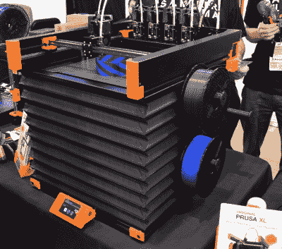](https://hackaday.com/wp-content/uploads/2022/10/errf22_prusaxl.jpg)

Prusa XL

事实是，现在是困难时期。在 Hackaday，我们已经详细报道了零件短缺问题，当你将这一问题与全球不断上升的通货膨胀联系在一起时，就不难理解为什么许多公司决定保持低调了。当你在保持现有产品的生产上遇到足够多的麻烦时，这几乎不是推出新产品的理想时机。

因此，虽然 Prusa，他本人和他的同名公司，今年都出席了，但没有像 2019 年那样的[惊喜产品展示。一台 Prusa XL 在那里运行一些演示打印，](https://hackaday.com/2019/10/13/prusa-unveils-new-mini-printer-shakes-up-the-competition/)[雄心勃勃的大幅面机器](https://hackaday.com/2021/11/29/prusa-xl-goes-big-but-thats-only-half-the-story/)无疑吸引了一群人，但我们将不得不为神话般的 i3 MK 4 等待更长时间。

当然，现在不仅仅是公司处境艰难。当人们在能源和食品账单上苦苦挣扎时，一台新的 3D 打印机或几卷奇异的细丝都是奢侈品，必须被推到一边。就我开车去马里兰州花的油钱，我本可以呆在家里，在亚马逊上订购一台像样的打印机。鉴于世界上正在发生的事情，仍有如此多的人长途跋涉来到 ERRF，这一事实表明人们对这一活动的回归是多么兴奋。

## 死亡赛车的入侵

仅仅因为大男孩们今年没有带太多新玩具来玩，并不意味着没有什么有趣的东西可看。在各种个人的桌子上看到可疑相似的打印战斗机器人后，我不得不仔细看看，看看这是怎么回事。

 [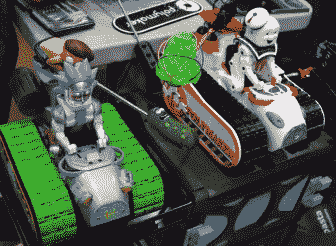](https://hackaday.com/2022/10/14/errf-22-after-two-years-back-and-better-than-ever/errf22_racer2/)  [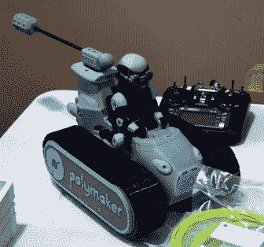](https://hackaday.com/2022/10/14/errf-22-after-two-years-back-and-better-than-ever/errf22_racer6/)  [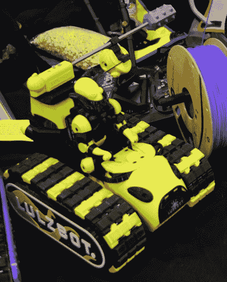](https://hackaday.com/2022/10/14/errf-22-after-two-years-back-and-better-than-ever/errf22_racer3/)  [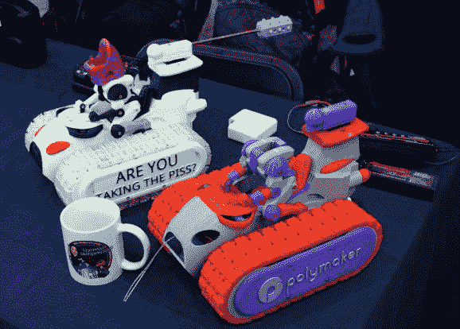](https://hackaday.com/2022/10/14/errf-22-after-two-years-back-and-better-than-ever/errf22_racer5/)  [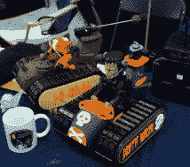](https://hackaday.com/2022/10/14/errf-22-after-two-years-back-and-better-than-ever/errf22_racer4/)  [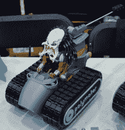](https://hackaday.com/2022/10/14/errf-22-after-two-years-back-and-better-than-ever/errf22_racer1/) 

原来基本设计[源自迈克尔·巴德利](https://www.youtube.com/c/michaelbaddeley)，但在过去半年左右的时间里，由于 YouTube 上的 3D 打印社区，它有了自己的生命。正如你在这里的图库中看到的，对核心履带式机器人的大多数修改都是装饰性的，以便保持性能尽可能相似，以达到竞争目的。这个想法是使用你坦克后面的旋转吊杆来敲下你对手的头——聪明的是，电子速度控制器的主电源通过安装在头部下方的一个粗壮的拨动开关连接，这样一旦“驾驶员”被斩首，[车辆就再也无法移动](https://www.youtube.com/watch?v=PqwJk8rcAIU)。

但是为什么有那么多人在这个特殊的活动中徘徊呢？眼尖的读者可能会注意到几个参赛者都有 Polymaker 的标志，这不仅仅是巧合。原来，灯丝制造商正在进行一项促销活动，他们将向任何去 ERRF 的人提供他们需要的灯丝来打印一辆死亡赛车，只要他们的名字自豪地印在旁边。聪明。

## 嘿，我知道这个打印机

 对我个人来说，参加这样的活动最大的好处之一就是我会不可避免地偶然发现一个我们已经在 Hackaday 上讨论过的项目。近距离观看这些作品，并与制作它们的热情的人们见面，总是非常有益的。尤其是在我们的报道对项目产生了有益影响的情况下，因为在一天结束时，这才是真正的意义所在。

这一次，我花了一些时间和 Adam Fasnacht 聊天，并查看了他改装的带有传送带的 Ender 3，用于“无限”打印。上个月，我们[报道了开源修改](https://hackaday.com/2022/09/27/infinite-axis-printing-on-the-ender-3/)，以及亚当的羽翼未丰的公司 powerbelt 3d——但是仍然没有什么比亲自看到硬件更好的了。

在我的访问中，我还看到了最新的可可压榨巧克力打印机。我第一次遇到这个项目是在 2018 年纽约世界创客大会期间，当时它几乎占据了整个桌子，并且是由木头制成的*。到 [2019 年费城创客节](https://hackaday.com/2019/10/20/maker-spirit-alive-and-well-at-the-philly-maker-faire/)开始时，设计已经相当完善，但这种新版本的机器似乎是技术上的一次真正飞跃。*

 *[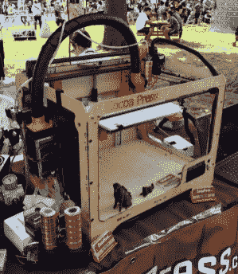](https://hackaday.com/2019/10/20/maker-spirit-alive-and-well-at-the-philly-maker-faire/phillyfaire_cocoa2/) 2018 [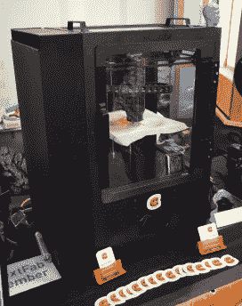](https://hackaday.com/2019/10/20/maker-spirit-alive-and-well-at-the-philly-maker-faire/phillyfaire_cocoa/) 2019 [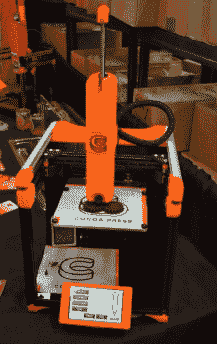](https://hackaday.com/2022/10/14/errf-22-after-two-years-back-and-better-than-ever/errf22_coco/) 2022

仍然不能 100%确定 3D 打印巧克力有巨大的市场，但不能否认可可出版社团队正在疯狂地推进他们的技术。

## 打印数天

虽然看到供应商提供的东西很有趣，并且与 3D 打印社区面对面的时间肯定有价值，但你*真正*去参加东海岸 RepRap Festival 这样的活动的原因是为了看到人们带来炫耀的所有令人难以置信的 3D 打印。

下面的画廊绝不是今年展出的详尽记录，但应该会让你知道如果你在 2023 年旅行，你可能会看到什么样的东西。

 [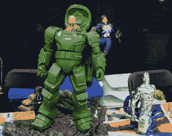](https://hackaday.com/2022/10/14/errf-22-after-two-years-back-and-better-than-ever/errf22_prints4/)  [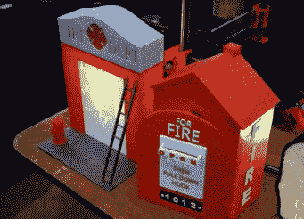](https://hackaday.com/2022/10/14/errf-22-after-two-years-back-and-better-than-ever/errf22_prints3/)  [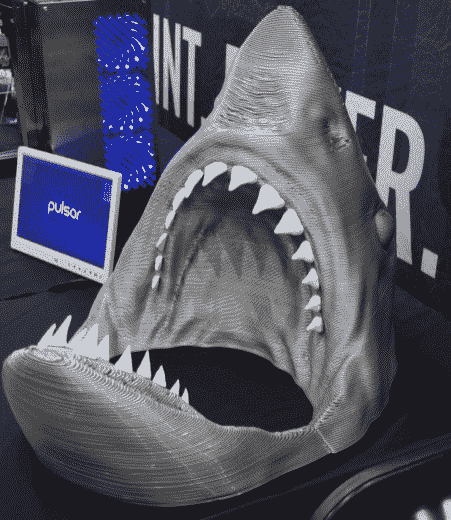](https://hackaday.com/2022/10/14/errf-22-after-two-years-back-and-better-than-ever/errf22_prints1/)  [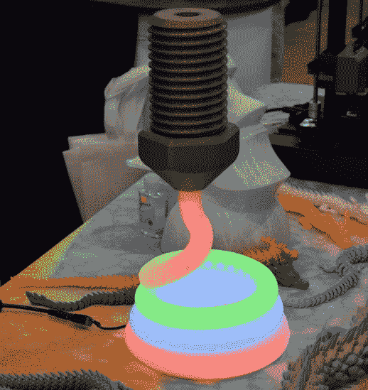](https://hackaday.com/2022/10/14/errf-22-after-two-years-back-and-better-than-ever/errf22_prints5/)  [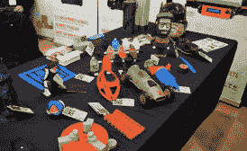](https://hackaday.com/2022/10/14/errf-22-after-two-years-back-and-better-than-ever/errf22_prints7/)  [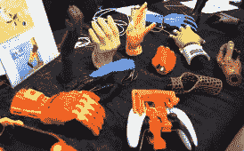](https://hackaday.com/2022/10/14/errf-22-after-two-years-back-and-better-than-ever/errf22_prints9/)  [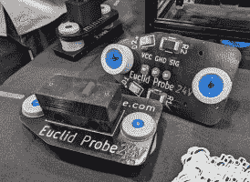](https://hackaday.com/2022/10/14/errf-22-after-two-years-back-and-better-than-ever/errf22_prints13/)  [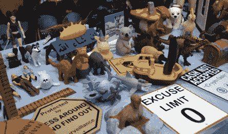](https://hackaday.com/2022/10/14/errf-22-after-two-years-back-and-better-than-ever/errf22_prints8b/)  [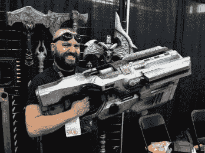](https://hackaday.com/2022/10/14/errf-22-after-two-years-back-and-better-than-ever/errf22_prints10/)  [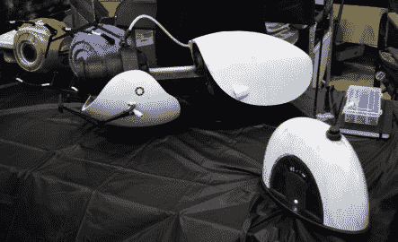](https://hackaday.com/2022/10/14/errf-22-after-two-years-back-and-better-than-ever/errf22_prints11/)    [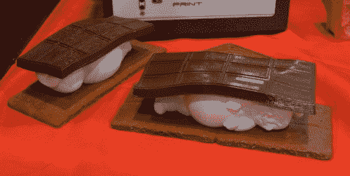](https://hackaday.com/2022/10/14/errf-22-after-two-years-back-and-better-than-ever/errf22_prints6/)  [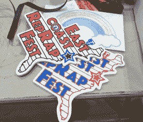](https://hackaday.com/2022/10/14/errf-22-after-two-years-back-and-better-than-ever/errf22_prints14/)  [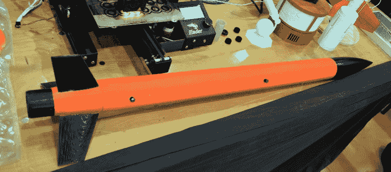](https://hackaday.com/2022/10/14/errf-22-after-two-years-back-and-better-than-ever/errf22_prints2/) 

## 敬请关注更多内容

你很快会在 Hackaday 上看到更多来自 2022 年东海岸说唱节的文章，有太多很酷的项目，无法一次收集起来。但是，即使你已经全部读完了，你仍然只能感受到这个活动的一小部分。

如果你对 3D 打印感兴趣，并且有可能成行，我强烈建议你明年出发。它可能没有更古老的中西部说唱音乐节的血统，但 ERRF 确实有明显的优势，不是在印第安纳州的某个偏僻的地方举行。*