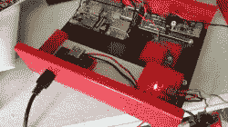
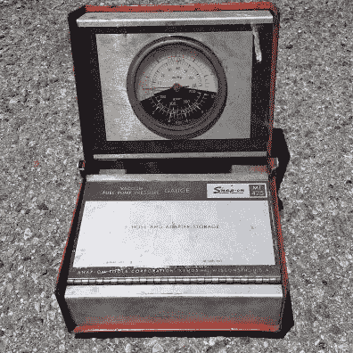
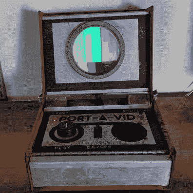
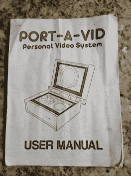
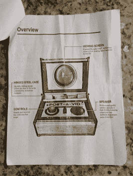
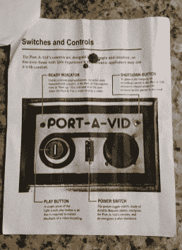

# 通过视频端口逃到任何地方的另一个世界

> 原文：<https://hackaday.com/2020/10/19/escape-to-an-alternate-reality-anywhere-with-port-a-vid/>

曾几何时，只有最昂贵的电视机才能在可安装在墙上的薄屏幕上拥有清晰的像素。曾经新奇的“高清平板电视”*现在只是随处可见的“电视”。因此，作为对我们现代像素完美的一种改变，【艾米丽·维拉斯科】[建造了 Port-A-Vid](https://twitter.com/MLE_Online/status/1316918549307379713) 作为另一个时间线的遗迹。*

 *任何注重美感的视频项目的中心显然是屏幕，CRT 将是复古主题的首选。不幸的是，小型 CRT[最近变得很少](https://hackaday.com/2020/06/15/portable-video-looper-is-easy-as-pi/#comments)，而且一个真正的玻璃显像管无论如何也放不进可用的空间。相反，我们实际上是在看一个现代的液晶显示器坐在一个大镜头后面，给它一个老学校的外观。

 这个从背投电视中获得的镜头被选中，因为它的尺寸很适合代替真空计的刻度盘。这个项目外壳开始时是一个 Snap-On Tools MT425，但后来变成了一个废品站的另一个破设备。底部以前是软管和适配器的储存箱，现在是电池和电子设备的所在地。铰链存储盖上的所有原始标记都被移除，并且[被转换为 Port-A-Vid 控制面板](https://twitter.com/MLE_Online/status/1299427214514102272)。

  Before: broken Snap-On MT425  After: An escape portal. Please stand by…

只要按一下绿色的大按钮，就会播放一段视频，这段视频是从[艾米丽]精心策划的符合审美的内容集中随机选取的。我们可能会从一部老的教育电影中得到一个剪辑，或者用复合摄像机拍摄的一些东西。如果弹出任何计算机图形，它们将是原始矢量图形。这不是寻找超高清内容的地方。

      

作为对电子历史上常见人工制品的最后认可，[Emily]为 Port-A-Vid 写了一本用户手册。自然，它不是一个可下载的 PDF，而是一叠钉在一起的纸。每一页都以昔日电子手册的风格书写，用多代影印的粗糙外观处理，因使用而起皱。

如果非要问“为什么？”任何解释都不足以说明问题。这是[Emily]的许多其他折衷项目共有的特征。但是如果你喜欢来自想象中的过去的幻想项目，[Emily]也为老式并行端口打印机制作了一个 ASCII 艺术墨盒。

 [https://www.youtube.com/embed/_khXcIHdas8?version=3&rel=1&showsearch=0&showinfo=1&iv_load_policy=1&fs=1&hl=en-US&autohide=2&wmode=transparent](https://www.youtube.com/embed/_khXcIHdas8?version=3&rel=1&showsearch=0&showinfo=1&iv_load_policy=1&fs=1&hl=en-US&autohide=2&wmode=transparent)

*