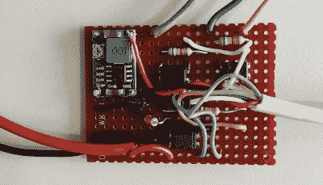

# ESP32 为 20 世纪 90 年代的家庭报警系统增加了新功能

> 原文：<https://hackaday.com/2020/11/02/esp32-adds-new-features-to-1990s-home-alarm-system/>

鉴于技术进步如此之快，一些消费电子产品每隔几年就会被更新换代。手机是一个特别好的例子，你可能不想拿着它超过 4 年左右，电视紧随其后。另一方面，像家庭报警系统这样的东西可以存在几十年。只要有人想砸窗户时它还会响，你还需要什么？

好吧，如果你像[布雷特·拉尼欧什]一样，你可能希望能够从你的手机启动系统并检查其当前状态。但是他没有得到一个全新的系统，而是决定用一个 ESP32 来升级他的大约 1993 年的 Gardiner Gardtec 800 报警器。碰巧的是，原来的面板有一个扩展连接器，他无需对报警器本身进行任何修改就可以接入。如果你有一个类似的面板，你甚至可以使用他的源代码和电路原理图来执行你自己的修改。

Optocouplers link the ESP and alarm panel.

现在我们知道你在想什么了。当然，信任一个连接到互联网的 ESP32 能够解除你家的报警系统是有风险的。[Brett]已经考虑到这一点，并确保运行在微控制器上的 web 服务器只能从本地网络访问。如果他确实想在 WiFi 范围之外连接，他会通过 VPN。换句话说，他的代码从来不会直接暴露在互联网的荒野中，而总是隐藏在某种加密的背后。

WiFi 连接允许[Brett]远程启动和解除警报系统，检查它是否被触发，并在必要时重置它，所有这些都可以从他的智能手机上完成。但是他还增加了一个 433 MHz 的接收器，所以如果他不想通过电话，他可以使用简单的手持遥控器来装备系统。即使你失去了互联网连接，这本身就是一个很好的升级。

对于那些不怕采取更具侵入性的方法的人来说，你可以对你的旧警报面板进行逆向工程和重新编程。或者你甚至可以走完全的 DIY 路线，使用 ESP32 和现成的模块创建自己的[低成本报警系统。](https://hackaday.com/2020/04/02/diy-esp32-alarm-system-leverages-433-mhz-sensors/)