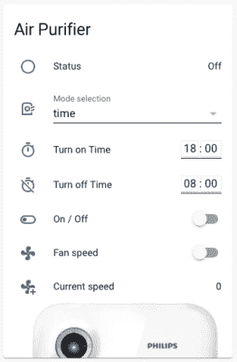

# ESP32 通过家庭助手将空气净化器上线

> 原文：<https://hackaday.com/2021/11/25/esp32-brings-air-purifier-online-with-home-assistant/>

许多黑客理所当然地担心当今许多“智能”设备的隐私问题，但很难否认远程控制家中设备的能力不方便。进入自托管，开源项目，如家庭助理。这为构建一个家庭自动化系统提供了框架，而不需要出售你的灵魂信息，但是正如你所预料的，你将不得不付出一些努力来充分利用它。

例如，看看这个 [Phillips AC4014 空气净化器，【安东】通过 ESP32 连接到家庭助理](https://hackaday.io/project/182589-making-an-old-air-purifier-smart)。他没有陷入对净化器令人惊讶的复杂内部电子设备的逆向工程，而是采取了简单的方法，在电源和风扇速度按钮之间连接了几个继电器；这使得微控制器可以轻松控制该器件，而不会影响原始控制的功能。

 但是由于这些前面板控制仍然工作，这意味着【安东】需要一种方法让 ESP32 检测设备的状态，并将其报告给家庭助理，以便一切保持同步。因此，他在 PCB 上四处寻找空气净化器启动并运行时通电的迹线，他通过晶体管将其连接到微控制器的引脚。这让固件通过检查适当的引脚是否变高来确定机器是否正在运行。

说到固件，[Anton]决定使用 ESPHome，而不是试图从头开始编写自己的代码。这个项目通过为固件提供一个相对简单的 YAML 配置文件，让你可以快速地给 Home Assistant 添加新设备，这是他提供的一个例子。事实上，他已经为这个项目提供了相当多的例子，一直到 PCB 的注释图像，显示了在哪里接入电线。他为所有拥有相同型号空气净化器的人提供了很好的服务。

这个装置似乎没有任何实际检查室内空气质量的功能，[但我们最近看到一款低价的宜家产品可以做到这一点](https://hackaday.com/2021/07/24/esp8266-adds-wifi-logging-to-ikeas-air-quality-sensor/)。更好的是，它可以被[很容易地修改来使用 ESP8266](https://hackaday.com/2021/08/13/hacked-ikea-air-quality-sensor-gets-custom-pcb/) 通过网络报告它的发现。