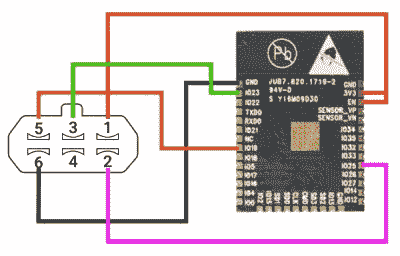

# ESP32 改进 Game Boy 蓝牙适配器

> 原文：<https://hackaday.com/2020/04/21/esp32-refines-game-boy-bluetooth-adapter/>

去年，我们从[Shyri Villar]那里得到了一个项目的消息，该项目利用系统的“多引导”功能，将一台普通游戏机变成了蓝牙控制器。原型硬件有点笨拙，但概念肯定是有前途的。我们现在很高兴地报告，代码已经被移植到了 ESP32 上，[使得这个项目变得更加平易近人](https://hackaday.io/project/166654-game-boy-advance-bluetooth-hid)。

 澄清一下，ESP32 现在是那些想在家一起玩的人唯一需要的*组件。只有五根导线将微控制器连接到 GBA 的 Link 线缆连接器，这足以将一个小 ROM 传输到系统，并将用户输入传输到蓝牙硬件。即使您对将它用作游戏控制器不感兴趣，这个项目也是一个很好的例子，说明了如何让您自己的代码运行在完全库存的 GBA 上。*

 *虽然硬件的原始版本是从手持设备的扩展连接器上悬挂下来的一块 perfboard，但将零件数量减少到一个意味着[Shyri]能够将所有东西打包到一个整洁的外壳中。具体来说，第三方 GBA 到 GameCube 的连接线。这不仅为微控制器提供了一个光滑的外壳，通过弹簧加载的标签锁定到手持设备上，而且还包括一个可以回收的公连接电缆连接器。看起来好像有一点塑料装饰涉及到让 ESP32 适合，但除此之外，它是一个非常干净的安装。

GBA 很快就要 20 岁了，但这并不意味着硬件[和软件探索已经结束](https://hackaday.com/2020/01/31/the-multiyear-hunt-for-a-gameboy-games-bug/)。最初的 Game Boy 已经 30 多岁了，[人们仍然在谈论它](https://hackaday.com/2020/03/14/the-ultimate-game-boy-talk/)。*