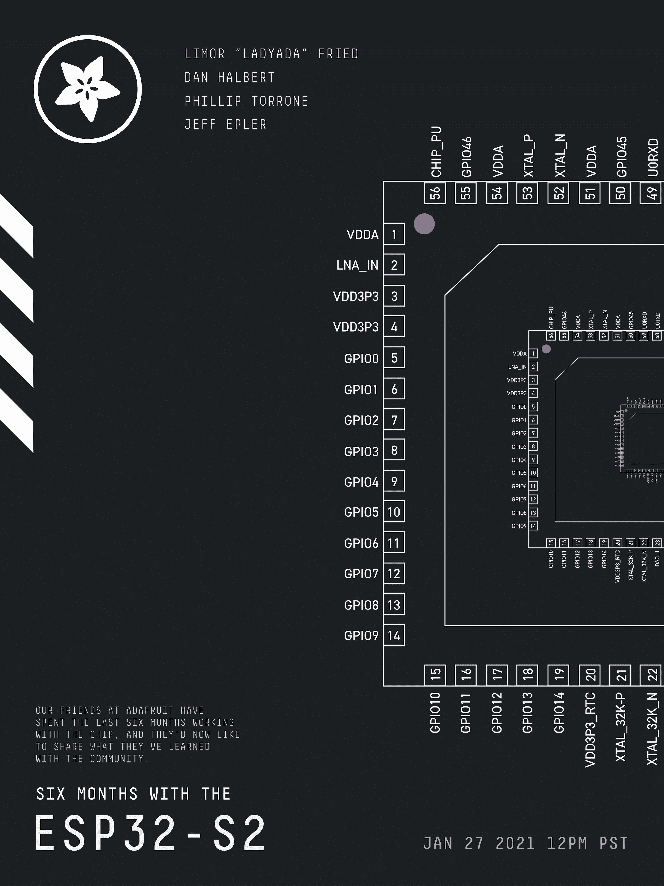
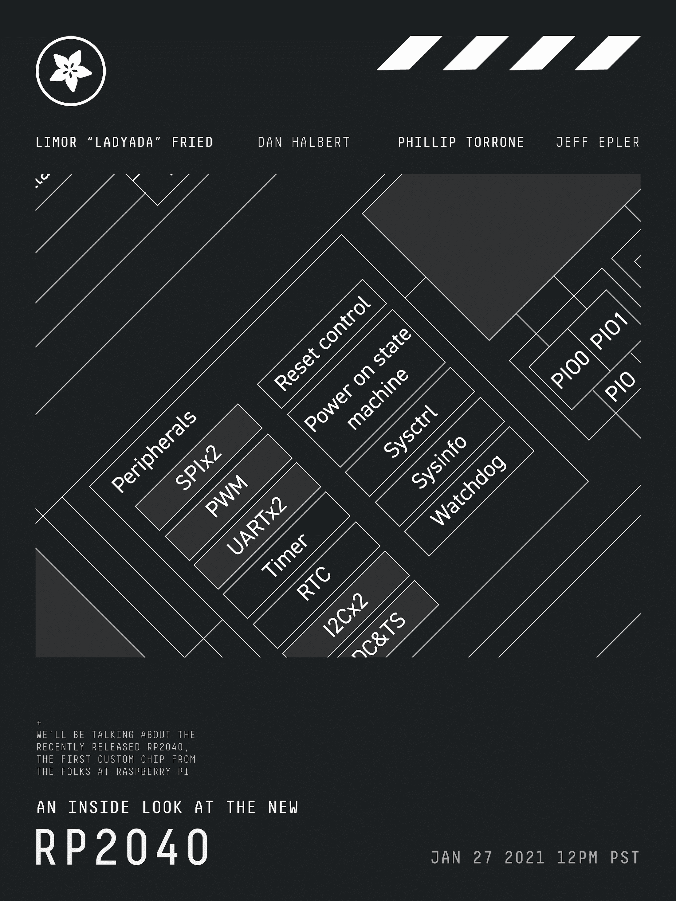

# ESP32-S2 和 RP2040 与 Adafruit 聊天

> 原文：<https://hackaday.com/2021/01/25/esp32-s2-and-rp2040-hack-chat-with-adafruit/>

加入我们太平洋时间 1 月 27 日星期三中午与 Adafruit 的 [ESP32-S2 和 RP2040 黑客聊天](https://hackaday.io/event/175898-six-months-with-the-esp32-s2-hack-chat)！

当我们在 Hack Chat 上有 Adafruit 时，这总是一个事件，上次也不例外。当时，ESP32-S2 是一个新的新事物，Adafruit 只是潜入芯片的可能性。这是一个有趣的怪兽——它只有一个内核，没有内置蓝牙或以太网，似乎不如其他 Espressif 芯片强大。但是有了更快的 CPU、更多的 GPIO 和 ADC、RISC-V 协处理器和原生 USB，该芯片看起来很有前途。

在他们的其他职责中，Adafruit 的人们已经花了六个月的时间研究芯片，现在他们想与社区分享他们所学到的东西。因此，[利莫尔·“lady ada”·弗里德](https://hackaday.io/hacker/9615-ladyada)、[菲利普·托伦、斯科特·肖克罗夫特](https://hackaday.io/hacker/194126-tannewt)、[丹·哈尔伯特](https://hackaday.io/dhalbert)和[杰夫·埃普勒](https://hackaday.io/hacker/431814-jeff-epler)将在黑客聊天室停下来向我们展示 ESP32-S2 的内幕。他们已经在一系列使用该芯片的项目上工作过，并且他们已经深入了解了该芯片的深度睡眠功能，所以停下来聊聊你关于低功耗应用或任何与 ESP32-S2 相关的紧迫问题，然后问吧。

此外，还有一个令人兴奋的新议程:他们将讨论最近发布的 RP2040，这是 Raspberry Pi 公司的第一款定制芯片。我们已经开始讨论[Raspberry Pi Pico](https://hackaday.com/2021/01/20/raspberry-pi-enters-microcontroller-game-with-4-pico/)，使用该芯片的开发板，Adafruit 将分享他们迄今为止对 RP2040 的了解。

 我们的黑客聊天是 [Hackaday.io 黑客聊天群发消息](https://hackaday.io/messages/room/2369)中的社区直播活动。本周，我们将于太平洋时间 1 月 27 日星期三中午 12:00 坐下来讨论。如果时区束缚了你，我们有[一个方便的时区转换器](https://www.timeanddate.com/countdown/generic?iso=20210127T12&p0=224&msg=Six+Months+With+the+ESP32-S2+Hack+Chat&font=cursive)。

点击右边的那个发言气泡，你会被直接带到 Hackaday.io 上的黑客聊天群，不用等到周三；随时加入，你可以看到社区在谈论什么。

