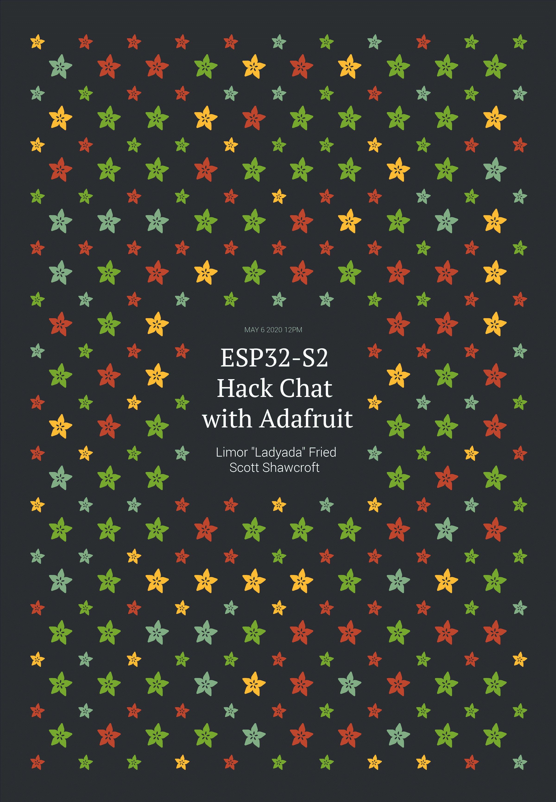

# ESP32-S2 与阿达弗洛聊天

> 原文：<https://hackaday.com/2020/05/04/esp32-s2-hack-chat-with-adafruit/>

加入我们太平洋时间 5 月 6 日星期三中午的 ESP32-S2 黑客访谈，与[Limor“lady ada”Fried](https://hackaday.io/hacker/9615-ladyada)和 [Scott Shawcroft](https://hackaday.io/hacker/194126-tannewt) ！

当 Espressif 在 2014 年发布 ESP8266 微控制器时，没有人能预测到这款芯片会有多成功。虽然它直接瞄准了新生的物联网市场，并进入了智能灯泡等数百种消费设备，但由于其强大的微控制器、WiFi 和大量 GPIO，黑客们兴致勃勃地抓住了芯片和开发板。

然而，ESP8266 并非没有问题，安全性始终是其中之一。2016 年发布的 ESP32 解决了其中一些问题。新芯片增加了另一个 CPU 内核、一个协处理器、蓝牙支持、更多 GPIO、以太网、CAN、更多更好的 ADC、一对 DAC 和一系列其他功能，使其成为黑客世界的宠儿。

现在，在 2019 年 9 月宣布后，[ESP32-S2 终于进入了业余爱好者的手中](https://hackaday.com/2020/03/23/esp32-s2-samples-show-up/)。从表面上看，S2 似乎能力较弱，它只有一个内核，既没有蓝牙也没有以太网。但是，凭借更快的 CPU、更多的 GPIO、更多的 ADC、RISC-V 协处理器、原生 USB 以及极低电流消耗的承诺，随着它的建立，ESP32-S2 可能会更受爱好者的欢迎。

为了让我们了解新芯片的潜力，Adafruit Industries 的 Limor“lady ada”Fried 和 Scott Shawcroft 将加入我们的黑客聊天。来吧，了解您需要了解的关于 ESP32-S2 的一切，以及如何让它为您服务。

 我们的黑客聊天是 [Hackaday.io 黑客聊天群发消息](https://hackaday.io/messages/room/2369)中的社区直播活动。本周，我们将于太平洋时间 5 月 6 日星期三中午 12:00 坐下来讨论。如果时区让你烦恼，我们有[一个方便的时区转换器](https://www.timeanddate.com/countdown/generic?iso=20200506T12&p0=224&msg=ESP32-S2+Hack+Chat+with+Adafruit&font=cursive)。

点击右边的那个发言气泡，你会被直接带到 Hackaday.io 上的黑客聊天群，不用等到周三；随时加入，你可以看到社区在谈论什么。

