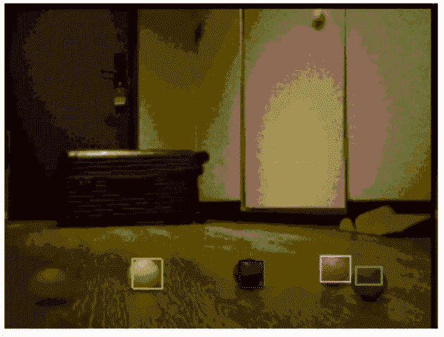

# 使用 I2S 的 ESP32 视频输入

> 原文：<https://hackaday.com/2021/08/23/esp32-video-input-using-i2s/>

计算机工程专业的学生[sherwin-dc]有一个漫游者项目，该项目需要通过 ESP32 流式传输视频，并通过 web 服务器进行访问。他找不到 ESP32 的标准摄像头接口的文档，但即使他有，这种方法也使用了太多的 I/O 引脚。相反，[舍温-dc]决定将一段视频塞进 I2S 的视频流。这有助于他使用 Altera MAX 10 FPGA 来处理来自摄像机的视频信号。他确实成功了，但是在 ESP32 的有限资源下工作需要大量的实验。最终[sherwin-dc]决定 QVGA 分辨率为 320×240 像素，每像素 8 位。这意味着每帧仅使用 77 KB 的珍贵的 ESP32 RAM。

他的设计使用了 2.5 MHz 的 SCK，相当于每秒 4 帧。但他指出，在几十 MHz 的更高 SCK 速率下，帧速率可能会明显更高——理论上。但考虑到其他系统处理，ESP32 连四 FPS 都赶不上。最后，他幸运地获得了 0.5 FPS 的吞吐量，但这对于控制火星车的目的来说已经足够了(见休息下方的动画 GIF)。也就是说，如果您的设计中有一个更强大的处理器，这种技术可能会引起您的兴趣。[Sherwin-dc]指出，ESP32 的标准摄像头驱动程序使用 I2S，因此这个概念并不疯狂。

我们之前已经报道了几篇关于在 I2S 生成视频的文章，包括 2019 年的这篇文章。你有没有征用过“标签外”使用的方案？

