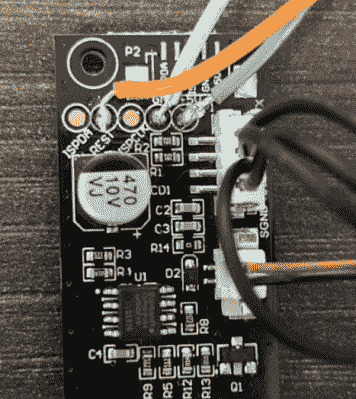

# ESP8266 为宜家的空气质量传感器增加了 WiFi 记录功能

> 原文：<https://hackaday.com/2021/07/24/esp8266-adds-wifi-logging-to-ikeas-air-quality-sensor/>

早在 6 月份推出的 IKEA VINDRIKTNING 是一款价值 12 美元的传感器，它使用彩色发光二极管，根据它吸收的颗粒数量来指示家中的相对空气质量。为了改善这种简单的界面，[[sren Beye]在电路板上安装了一个 ESP8266，这样它就可以通过 MQTT](https://github.com/Hypfer/esp8266-vindriktning-particle-sensor) 广播传感器读数。

Just three wires link the ESP8266 to the PCB.

虽然我们中的一些人可能会试图将 VINDRIKTNING 的粒子传感器直接连接到 ESP8266 上，但[Soren]使用的方法实际上相当优雅。微控制器只是监听传感器和原始控制器之间的 UART 通信，而不是替换宜家的电子产品。这不仅保留了 VINDRIKTNING 的基本功能，而且简化了代码，因为 ESP 几乎不需要做这么多。

如果你想进行这种修改，你需要做的就是将几根线焊接到 VINDRIKTNING 板上方便的测试焊盘上，然后刷新固件(或者编写你自己的版本)，你就可以开始了。ESP8266 的外壳内部有足够的空间，但您可能需要用胶带将其粘住，以免影响气流。

虽然不是必须的，但[sren]也建议对 VINDRIKTNING 做一点小改动，让它更安静一些。显然，传感器内部的 5 V 风扇偶尔会被原来的控制器加速，而不是保持在一个连续的水平，你可以在心理上调整。但通过将传感器的风扇连接到 ESP8266 的 3.3 V 引脚，它将持续以较低的速度运行。

[在](https://hackaday.com/2021/02/17/custom-firmware-for-ikeas-orsala-lamp/)之前，我们已经见过宜家产品的定制固件，但这种方法，无论二级微控制器中闪存了什么，都能保持设备的功能不变，对于我们这些似乎无法将小精灵排除在代码之外的人来说，特别有吸引力。

【感谢 nexgensri 的提示。]