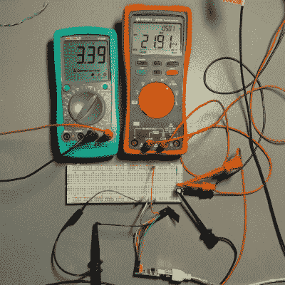

# ESP8266 Web 服务器延迟 1 毫秒，可节能 60%

> 原文：<https://hackaday.com/2022/10/28/esp8266-web-server-saves-60-power-with-a-1-ms-delay/>

Arduino 有一个库，可以在基于 ESP8622 的板上快速轻松地设置一个简单的 web 服务器，[toma]发现只需在正确的位置插入 1 ms 的延迟，ESP-01 上的[功耗就可以大大降低。这种工作的原因不是因为一些奇怪的错误或古怪的功能——这实际上只是硬件如何在引擎盖下运行的副作用。](https://www.tablix.org/~avian/blog/archives/2022/08/saving_power_on_an_esp8266_web_server_using_delays/)

【托马】用来自 ESP8266WebServer 的[“hello world”例子来解释。在其中，主循环本质上由永远调用`server.handleClient()`组成。这个过程检查传入的 HTTP 连接，处理它们，发送响应，退出——然后再重复一遍。像这样一个简单的 web 服务器大部分时间都在等待。](https://github.com/esp8266/Arduino/blob/313b3c07ecccbe6fee24aa9fa447c4aed16ca499/libraries/ESP8266WebServer/examples/HelloServer/HelloServer.ino)

 一种更有效的处理方式是，只有当有网络连接请求时才启动`server.handleClient()`，如果没有，就让硬件休眠。然而，在 Arduino 的 ESP8266WebServer 库的上下文中，这种级别的控制是不可能的。

那么该怎么办呢？下一个最好的事情是在主循环中的每个`server.handleClient()`调用之后紧接着一个简单的`delay(1)`语句。

为什么会这样？添加`delay(1)`实际上会导致 CPU 在那一毫秒的循环中花费绝大部分时间。就功率而言，计算微秒数比每秒检查十万次网络请求要简单得多。在[托马]的测试中，1 毫秒的延迟将 3.3 V 下的空闲功耗从大约 230 mW 降低到大约 70mw——大约 60%——同时仅将 web 服务器的响应时间延迟了 6-8 毫秒。

对于简单的 web 服务器应用程序，这无疑是一个需要记住的好技巧。在基于 ESP8266 的主板上，还有更先进的节能技术；从睡眠时几乎不吸一微安的主板，到硬币电池供电的主板[甚至修改了 TCP/IP 堆栈，以帮助尽可能节省每一点电能](https://hackaday.com/2018/01/22/how-low-can-an-esp8266-go/)。