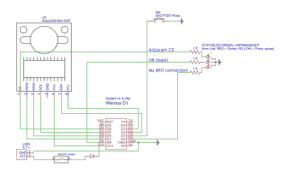

# ESP8266 Wi-Fi 即时相机是一个简单的射手

> 原文：<https://hackaday.com/2018/11/13/esp8266-wi-fi-instant-camera-is-a-simple-shooter/>

如果一款结合了宝丽来的即时满足感和云主机的相机听起来很吸引你，那么看看这款由[Martin Fasani] 创造的 [ESP 驱动的傻瓜相机就知道了。这款相机没有屏幕，也没有复杂的配置；只要按一下按钮，原始图片就会出现在网上画廊。不知何故，它同时是经典“即时相机”概念的最简单和最复杂的实现之一，我们喜欢它。](https://hackaday.io/project/162256-esp32-8266-wifi-instant-camera)

 相机本身的电子设备，马丁称之为 FS2，相当简单。在核心部分，它只不过是一个 ESP 板、一个 ArduCAM 相机模块和一个快门瞬时按钮。为了便于携带，他增加了 2000 毫安时的锂离子电池和 Adafruit Micro 微型 USB 充电器。[Martin]增加了对可选的 128×64 有机发光二极管显示器的支持，以获得用户反馈。一切都装在一个相对宽敞的 3D 打印外壳中，为未来可能的硬件留下了一些空间。

ESP8266 和 ESP32 都有固件版本，因此任何一代流行微控制器的粉丝都被邀请参加派对。如果你使用更强大的 32 位芯片，处理图像显然会快一点，但另一方面，ESP8266 使用 SPI 闪存的 3MB 作为上传期间图像的本地缓冲区，这有助于防止在将图像推送到云时出现问题。该相机旨在尽可能简单，因此目前除了拍摄静态图像之外，唯一的选择是延时模式。[马丁]希望在未来实现一些额外的过滤器和效果。他也希望其他人能帮助他的固件。他特别寻求帮助，使自动对焦工作，并为图像上传实施更强大的误差校正。

我们已经看到了一些令人印象深刻的 DIY 相机制作，使用了从回收的热传感器到 T2 胶片和熔化的铝。但是[马丁]在这里所做的古怪简单的东西真的把他的项目放在了一个全新的类别中。

 [https://www.youtube.com/embed/rPsmIy8i20M?version=3&rel=1&showsearch=0&showinfo=1&iv_load_policy=1&fs=1&hl=en-US&autohide=2&wmode=transparent](https://www.youtube.com/embed/rPsmIy8i20M?version=3&rel=1&showsearch=0&showinfo=1&iv_load_policy=1&fs=1&hl=en-US&autohide=2&wmode=transparent)

